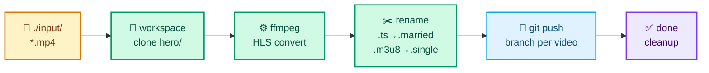

<p align="center">
  
</p>

<h1 align="center">ivideo-hls</h1>

<p align="center">
  Batch-convert <code>.mp4</code> files to HLS and publish each one to a git branch — with a live Bubble Tea TUI.
</p>

---

## How it works

For each video, ivideo-hls runs a 7-stage pipeline:



---

## Requirements

| Dependency | Install |
|---|---|
| Go 1.25+ | [go.dev/dl](https://go.dev/dl/) |
| `git` | `brew install git` · `apt install git` |
| `ffmpeg` + `ffprobe` | `./ivideo-hls install-deps` *(no sudo)* or `brew install ffmpeg` |
| SSH key or HTTPS token | For the git remote |

---

## Install

```bash
# Build
go build -o ivideo-hls ./cmd/ivideo-hls

# Download ffmpeg + ffprobe into ~/.cache/ivideo-hls/bin/ (first time only)
./ivideo-hls install-deps

# Verify environment
./ivideo-hls doctor

# Run
./ivideo-hls
```

---

## Usage

### Interactive TUI

```bash
./ivideo-hls
```

Pick videos → configure → watch the live dashboard. Full keybinding reference: [docs/USAGE.md](docs/USAGE.md).

### Non-interactive (CI / batch)

```bash
# All videos, 4 parallel, high quality, plain logs
./ivideo-hls -a -j 4 -q high --no-tui
```

### Common flags

| Flag | Description |
|---|---|
| `-i file.mp4` | Input video (repeatable) |
| `-a` | Auto-select all videos in source dir |
| `-j N` | Parallel jobs (push pool = 2×) |
| `-q low\|medium\|high` | Output quality (default: `medium`) |
| `-c fast\|balanced\|best` | Compression preset (default: `balanced`) |
| `--compress` | Pre-compress before HLS conversion |
| `-r` | Recursive scan (skips `.git`, `hero*`, hidden dirs) |
| `--remote URL` | Override git remote |
| `--token STR` | HTTPS auth token |
| `--source DIR` | Source folder to scan |
| `--keep-source` | Keep original `.mp4` on success |
| `--no-push` | Commit locally, skip push |
| `--no-cleanup` | Keep workspace on success |
| `--settings` | Open persistent config editor |
| `--no-tui` | Plain-log output for CI |

Full flag reference and config precedence: [docs/CONFIGURATION.md](docs/CONFIGURATION.md).

---

## Recovery

When a job fails, the workspace and source `.mp4` are kept on disk. Run `doctor` to see what's waiting:

```bash
./ivideo-hls doctor          # diagnose — always safe, read-only
./ivideo-hls retry-failed    # push what's ready (no re-encoding)
./ivideo-hls resume-failed   # re-encode what's broken
```

| Scenario | Command |
|---|---|
| Encoding done, push failed | `retry-failed` |
| ffmpeg died mid-encode | `resume-failed` |
| Not sure what's on disk | `doctor` |

Both commands accept `-y` to skip confirmation. Full walkthrough: [docs/PROCESS.md](docs/PROCESS.md).

---

## Screens

<details>
<summary>📼 Picker</summary>

```
 ivideo-hls   HLS video pipeline ✦

┌───────────────────────────────────────────────────────────────┐
│ 📼 Videos in ~/Videos/lessons  ·  flat  ·  4 files            │
│                                                               │
│ ▶ ● lesson-01.mp4        12.4 MB                              │
│   ● lesson-02.mp4        14.1 MB                              │
│   ○ lesson-03.mp4         9.8 MB                              │
│   ○ lesson-04.mp4        11.2 MB                              │
│                                                               │
│  2 / 4  selected                                              │
└───────────────────────────────────────────────────────────────┘
 ↑/↓ move · space toggle · a all · 1-9 first N · s settings · enter → · q quit
```

</details>

<details>
<summary>▶️ Run dashboard</summary>

```
 ivideo-hls · processing · 3/8 done · 12:04 · ETA ~6m · → git@github.com:username/repo.git
 ──────────────────────────────────────────────────────────────────────
  ████████████████████░░░░░░░░  56%  lesson-02          convert   2.1x  2800k
  ████████████░░░░░░░░░░░░░░░░  38%  lesson-05          compress  1.8x  1400k
  ██░░░░░░░░░░░░░░░░░░░░░░░░░░   8%  lesson-06          workspace
  ░░░░░░░░░░░░░░░░░░░░░░░░░░░░   0%  lesson-07          queued
 ──────────────────────────────────────────────────────────────────────
 Done
  ✓ lesson-01              3m12s   pushed origin/lesson-01
  ✓ lesson-03              2m48s   pushed origin/lesson-03
 ──────────────────────────────────────────────────────────────────────
 Log · tail
 12:04:13 [lesson-02] HLS convert @ medium / balanced
 12:04:02 [lesson-05] compressed 12.4MB → 3.1MB (-74.8%)
 ──────────────────────────────────────────────────────────────────────
  ctrl+c cancel  ·  q quit (after done)
```

</details>

<details>
<summary>🩺 Doctor</summary>

```
 ivideo-hls · doctor

 ✓  ffmpeg         ~/Library/Caches/ivideo-hls/bin/ffmpeg  v7.1
 ✓  ffprobe        ~/Library/Caches/ivideo-hls/bin/ffprobe  v7.1
 ✓  git            /opt/homebrew/bin/git
 !  config file    not present — defaults in use
                    ↳ press `s` in the picker or run --settings
 ✓  remote URL     git@github.com:username/repo.git
 ✓  auth method    ssh
 !  ssh keys       agent has no keys loaded
                    ↳ ssh-add ~/.ssh/id_ed25519

 ! 2 warning(s), 7 ok
```

</details>

---

## Documentation

| Document | What it covers |
|---|---|
| [FUNCTIONAL_SPEC.md](docs/FUNCTIONAL_SPEC.md) | Exact behavior of every feature — inputs, outputs, edge cases |
| [ARCHITECTURE.md](docs/ARCHITECTURE.md) | Package layout, dependency graph, concurrency model |
| [PROCESS.md](docs/PROCESS.md) | End-to-end lifecycle and recovery decision tree |
| [USAGE.md](docs/USAGE.md) | TUI keybindings, all screens, common recipes |
| [CONFIGURATION.md](docs/CONFIGURATION.md) | Every config key, env var, flag precedence |
| [TROUBLESHOOTING.md](docs/TROUBLESHOOTING.md) | Symptom → step-by-step fix |
| [DEVELOPMENT.md](docs/DEVELOPMENT.md) | Build, test, extend, code conventions |
| [CHANGELOG.md](docs/CHANGELOG.md) | What changed per release |
| [CONTRIBUTING.md](CONTRIBUTING.md) | Contribution guidelines and PR process |
