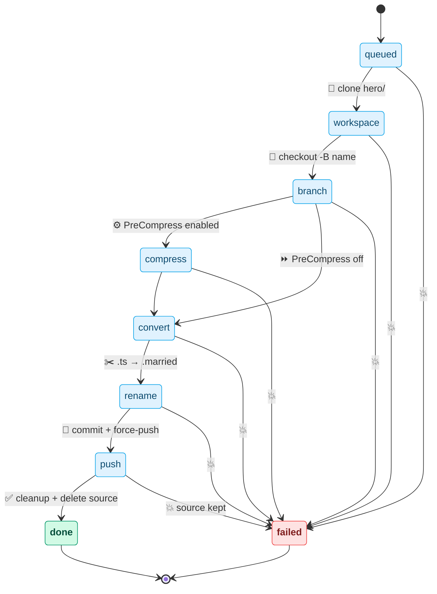
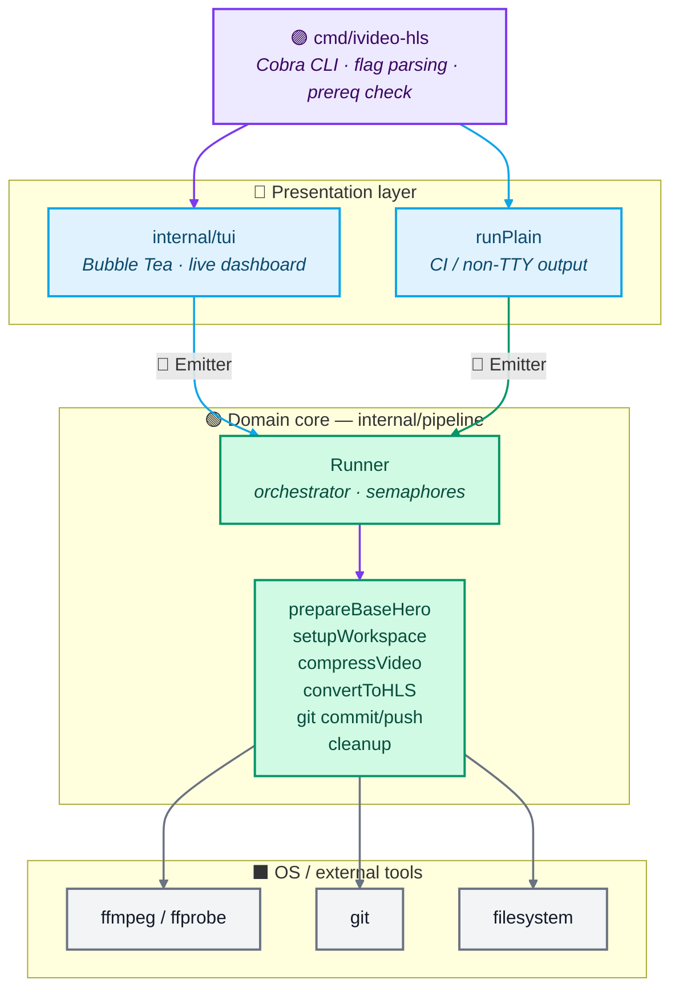

# Architecture

## Package dependency graph

The golden rule: **the pipeline core is free of UI and CLI concerns.**
`internal/pipeline` imports only the standard library and `internal/deps`.
The TUI, CLI, and settings packages all depend on the pipeline but not on
each other.

```mermaid
graph TD
    %% ── Colour palette ────────────────────────────────────────────
    %% 🟣 CLI  (entry-point)   #7C3AED / light #EDE9FE
    %% 🔵 TUI  (presentation)  #0EA5E9 / light #E0F2FE
    %% 🟢 Core (domain logic)  #059669 / light #D1FAE5
    %% 🟠 Libs (shared infra)  #D97706 / light #FEF3C7
    %% 🔴 forbidden dependency #EF4444

    subgraph cli["🟣  cmd/ivideo-hls  ·  CLI entry-point"]
        main["main\n<i>flag wiring · prereq check · dispatch</i>"]
        doctor_cmd["doctor\n<i>run diagnostics</i>"]
        install["install-deps\n<i>download ffmpeg binaries</i>"]
    end

    subgraph ui["🔵  internal/tui  ·  Presentation layer"]
        picker["picker\n<i>video checklist + config screen</i>"]
        settings["settings\n<i>persistent config editor</i>"]
        runner["runner\n<i>live progress dashboard</i>"]
    end

    subgraph core["🟢  internal/pipeline  ·  Domain core"]
        config["config\n<i>Config struct · quality enums</i>"]
        processor["processor\n<i>Runner · CPU/net semaphores</i>"]
        ffmpeg["ffmpeg\n<i>compress · HLS convert · rename</i>"]
        manifest["manifest\n<i>urls.txt writer</i>"]
        scan["scan\n<i>video discovery</i>"]
        events["events\n<i>Event · Emitter interface</i>"]
    end

    appcfg["🟠 internal/appconfig\n<i>load · save · validate config.toml</i>"]
    depspkg["🟠 internal/deps\n<i>resolve ffmpeg/ffprobe paths</i>"]
    doctor["🟠 internal/doctor\n<i>env diagnostics</i>"]

    %% ── CLI → layers ──────────────────────────────────────────────
    main --> picker
    main --> settings
    main --> runner
    main --> config
    main --> appcfg
    main --> depspkg
    doctor_cmd --> doctor
    install --> depspkg

    %% ── TUI → core ────────────────────────────────────────────────
    picker  --> scan
    runner  --> events
    settings --> appcfg

    %% ── Core → libs ───────────────────────────────────────────────
    processor --> ffmpeg
    processor --> manifest
    processor --> scan
    ffmpeg    --> depspkg
    doctor    --> appcfg
    doctor    --> depspkg

    %% ── Forbidden direction (core → UI) ───────────────────────────
    processor -.->|"🚫 forbidden dependency"| runner

    %% ── Node styles ───────────────────────────────────────────────
    classDef cliStyle  fill:#EDE9FE,stroke:#7C3AED,stroke-width:2px,color:#3B0764;
    classDef uiStyle   fill:#E0F2FE,stroke:#0EA5E9,stroke-width:2px,color:#0C4A6E;
    classDef coreStyle fill:#D1FAE5,stroke:#059669,stroke-width:2px,color:#064E3B;
    classDef libStyle  fill:#FEF3C7,stroke:#D97706,stroke-width:2px,color:#78350F;

    class main,doctor_cmd,install cliStyle;
    class picker,settings,runner uiStyle;
    class config,processor,ffmpeg,manifest,scan,events coreStyle;
    class appcfg,depspkg,doctor libStyle;

    %% ── Link colours by layer ──────────────────────────────────────
    %% CLI  links  0-7  → purple
    linkStyle 0,1,2,3,4,5,6,7 stroke:#7C3AED,stroke-width:1.8px;
    %% TUI  links  8-10 → blue
    linkStyle 8,9,10 stroke:#0EA5E9,stroke-width:1.8px;
    %% Core links 11-16 → green
    linkStyle 11,12,13,14,15,16 stroke:#059669,stroke-width:1.8px;
    %% Forbidden 17 → red dashed
    linkStyle 17 stroke:#EF4444,stroke-width:2.5px,stroke-dasharray:6 4;
```



No arrow points from `core` back into `ui` or `cli`. The TUI is an
optional consumer of `pipeline.Event`; the CLI is an optional driver.

## Per-video state machine

Every video is a state machine of eight states. Any failure short-circuits
to `failed`; the workspace is preserved for inspection and the source
`.mp4` is kept.



## Layered view



## Package responsibilities

| Package | Responsibility |
|---|---|
| `cmd/ivideo-hls` | Flags, prereq checks, choosing TUI vs plain output, summary printing. |
| `internal/pipeline/config.go` | `Config`, quality/compression enums, defaults. |
| `internal/pipeline/events.go` | `Event`, `Emitter`, level helpers. Single log channel for TUI + plain modes. |
| `internal/pipeline/exec.go` | `run`, `runQuiet`, `runCapture` wrappers over `exec.CommandContext`. |
| `internal/pipeline/git.go` | Lock cleanup, remote config, branch pruning on base repo. |
| `internal/pipeline/workspace.go` | `hero_*` workspace lifecycle: clone, reset, cleanup. Mutex-guarded base prep. |
| `internal/pipeline/ffmpeg.go` | Pre-compression + HLS conversion + `.ts/.m3u8` rename step. |
| `internal/pipeline/processor.go` | `Runner` orchestrator — CPU/net semaphores, per-video pipeline. |
| `internal/tui/styles.go` | All Lipgloss color definitions. |
| `internal/tui/picker.go` | Two-screen selector: video checklist → configuration. |
| `internal/tui/runner.go` | Live run screen with progress bars, spinner, activity log. |

## Data flow (per video)

1. **Workspace** — clone base `hero/` into `hero_<sanitized_name>/`, set SSH remote.
2. **Branch** — `git checkout -B <name>` (force-reset if exists).
3. **Compress** (optional) — `libx264 preset=medium crf=28` → `<name>_compressed.mp4`.
4. **Convert** — HLS via `libx264 + aac`, segment `index_NNN.ts`, playlist `index.m3u8`.
5. **Rename** — `.ts → .married`, rewrite playlist, `.m3u8 → .single`.
6. **Commit & push** — `git add . && git commit -m "a" && git push -u -f origin <name>`.
7. **Cleanup** — remove `hero_*/`, delete original `.mp4`.

## Concurrency model

- `cpuSem` — `maxParallel` slots. Guards ffmpeg (compress + convert).
- `netSem` — `maxParallel * 2` slots. Guards `git push`.
- Workspace copy runs **outside** semaphores to overlap with ffmpeg work.
- `prepareBaseHero` is mutex-guarded; called once before parallel fan-out.

## Event surface

`pipeline.Event` carries `{Job, Stage, Level, Message, Percent, Speed, Bitrate}`.
`Percent` is parsed live from ffmpeg's `-progress pipe:1` stream (`out_time_ms`
over total duration from `ffprobe`). `Speed` and `Bitrate` ride along so the
TUI dashboard can show encoding speed per job without a separate channel.
Stage → per-job overall progress mapping lives in `stageRange`; `stageProgress`
is derived from it, so the fallback (no real percent available) and the
running-bar position can never drift. Adding a new stage = add a constant in
`events.go` + a range in `stageRange` + emit it from the processor.

## Run-screen layout

The run dashboard is a single live frame inspired by `htop` — no modal screens
after the pipeline starts. Sections are stacked between horizontal rules; the
key footer is always visible.

```
 ivideo-hls · processing · 3/8 done · 12:04 · ETA ~6m · → git@github.com:username/repo.git
 ───────────────────────────────────────────────────────────────────────────
  ████████████████████░░░░░░░░  56%  lesson-02            convert     2.1x  2800k
  ████████████░░░░░░░░░░░░░░░░  38%  lesson-05            compress    1.8x  1400k
  ██░░░░░░░░░░░░░░░░░░░░░░░░░░   8%  lesson-06            workspace
  ░░░░░░░░░░░░░░░░░░░░░░░░░░░░   0%  lesson-07            queued
 ───────────────────────────────────────────────────────────────────────────
 Done
  ✓ lesson-01              3m12s   pushed origin/lesson-01
  ✓ lesson-03              2m48s   pushed origin/lesson-03
  ✓ lesson-04              3m01s   pushed origin/lesson-04
 ───────────────────────────────────────────────────────────────────────────
 Log · tail
 12:04:13 [lesson-02] HLS convert @ medium / balanced
 12:04:10 [lesson-06] checkout -B lesson-06
 12:04:02 [lesson-05] compressed 12.4MB → 3.1MB (-74.8%)
 ───────────────────────────────────────────────────────────────────────────
  ctrl+c cancel  ·  q quit (after done)
```

Regions:

- **Header** — one line: status · counts · elapsed · ETA · remote.
- **Running** — active jobs with a bar, percent, name, stage badge, encoding
  speed (parsed live from ffmpeg's `-progress speed=` field), current bitrate.
- **Done** — completed (non-failed) jobs with duration and last message.
  Visible from the first success until quit.
- **Failures** — only rendered when a job fails; pins the full error.
- **Log tail** — bounded by terminal height: 3 lines on small (< 20 rows),
  6 on medium, 10 on large.
- **Footer** — constant key hint, changes only at `done`.

## Adding features

- **New quality preset:** add constant in `config.go`, branch in `ffmpeg.go`, label in `picker.go`.
- **New stage (e.g. thumbnail):** add `Stage*` constant, emit from processor, add to `stageProgress`.
- **Different remote strategy:** extend `git.go::configureRemoteOrigin`; expose via `--remote` flag (already wired).
