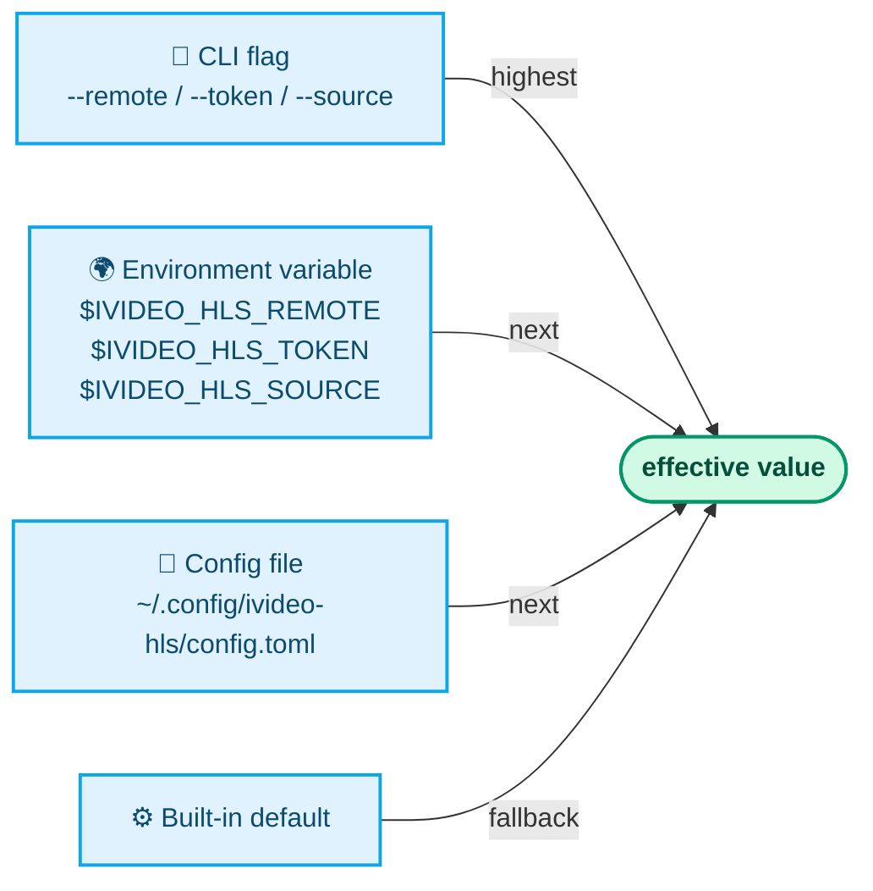

# Configuration reference

Every configuration value in ivideo-hls can be set in three ways.
**Precedence** (highest → lowest):



---

## Config file location

```
~/.config/ivideo-hls/config.toml   (default)
$XDG_CONFIG_HOME/ivideo-hls/config.toml   (if XDG_CONFIG_HOME is set)
```

File mode is `0600`. Open the TUI editor with:

```bash
./ivideo-hls --settings
# or press `s` on the picker screen
```

---

## All configuration keys

### Remote

| TOML key | CLI flag | Env var | Default | Description |
|---|---|---|---|---|
| `remote_url` | `--remote URL` | `$IVIDEO_HLS_REMOTE` | `git@github.com:username/repo.git` | Git push destination. SSH or HTTPS. |
| `auth_method` | *(settings only)* | — | `ssh` | `ssh` or `https`. Controls token injection. |
| `token` | `--token STR` | `$IVIDEO_HLS_TOKEN` | *(unset)* | HTTPS PAT. Injected into the push URL at runtime, never written to `git remote`. Stored plaintext at `0600`. |
| `playback_url` | *(settings only)* | — | *(unset)* | HTTP(S) template for `urls.txt`. Placeholders: `{branch}`, `{filename}`. |

### Source

| TOML key | CLI flag | Env var | Default | Description |
|---|---|---|---|---|
| `default_source_dir` | `--source DIR` | `$IVIDEO_HLS_SOURCE` | `./input/` → cwd fallback | Directory scanned for videos. Auto-created if missing when set explicitly. |
| `default_recursive` | `-r`, `--recursive` | — | `false` | Walk subdirectories. Prunes `.git`, `node_modules`, `hero*`, hidden dirs. |

### Run defaults

| TOML key | CLI flag | Default | Description |
|---|---|---|---|
| `default_parallel` | `-j N`, `-p` | `1` (serial) | Max concurrent ffmpeg jobs. Push pool auto-sizes to `2×`. |
| `default_quality` | `-q low\|medium\|high` | `medium` | Output quality preset. |
| `default_compression` | `-c fast\|balanced\|best` | `balanced` | ffmpeg `-preset` mapping. |
| `default_precompress` | `--compress` | `false` | Run `libx264 crf=28` pass before HLS segmentation. |
| `default_keep_source` | `--keep-source` | `false` | Keep original `.mp4` on success. |
| `default_no_push` | `--no-push` | `false` | Commit locally, skip push. Workspace and source kept. |
| `default_no_cleanup` | `--no-cleanup` | `false` | Keep `hero_<name>/` workspace on success. |

### Recovery

| TOML key | CLI flag | Default | Description |
|---|---|---|---|
| `resume_reuse_compressed` | *(settings only)* | `false` | When `resume-failed` runs, reuse a clean `_compressed.mp4` sibling and skip the compress stage. See [PROCESS.md](PROCESS.md#resume-policy-reuse-compressed-opt-in). |

---

## Quality presets

| Preset | Resolution | Video bitrate | Audio bitrate | ffmpeg `-preset` |
|---|---|---|---|---|
| `low` | 480p (`-2:480`) | 800k | 96k | `balanced` |
| `medium` *(default)* | 720p (`-2:720`) | 2800k | 128k | `balanced` |
| `high` | 1080p (`-2:1080`) | 5000k | 192k | `balanced` |

Compression preset (`-c`) overrides the ffmpeg `-preset` independently:

| Preset | ffmpeg `-preset` | CRF |
|---|---|---|
| `fast` | `fast` | `23` |
| `balanced` *(default)* | `medium` | `23` |
| `best` | `slow` | `26` |

---

## Environment variables

| Variable | Equivalent to |
|---|---|
| `$IVIDEO_HLS_REMOTE` | `--remote URL` |
| `$IVIDEO_HLS_TOKEN` | `--token STR` |
| `$IVIDEO_HLS_SOURCE` | `--source DIR` |

Prefer env vars for CI and ephemeral contexts so secrets are never written to disk.

---

## Example `config.toml`

```toml
# ~/.config/ivideo-hls/config.toml

remote_url       = "git@github.com:org/video-repo.git"
auth_method      = "ssh"
playback_url     = "https://raw.githubusercontent.com/org/video-repo/{branch}/x/{filename}"

default_source_dir   = "~/Videos/lessons"
default_recursive    = false

default_parallel     = 2
default_quality      = "medium"
default_compression  = "balanced"
default_precompress  = false
default_keep_source  = false

resume_reuse_compressed = false
```

---

## Related docs

- [`USAGE.md`](USAGE.md) — operator guide and keybindings.
- [`PROCESS.md`](PROCESS.md) — end-to-end lifecycle and recovery flow.
- [`../README.md`](../README.md) — quick-start and flag reference table.
