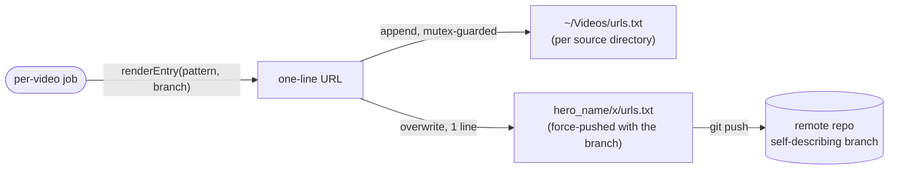
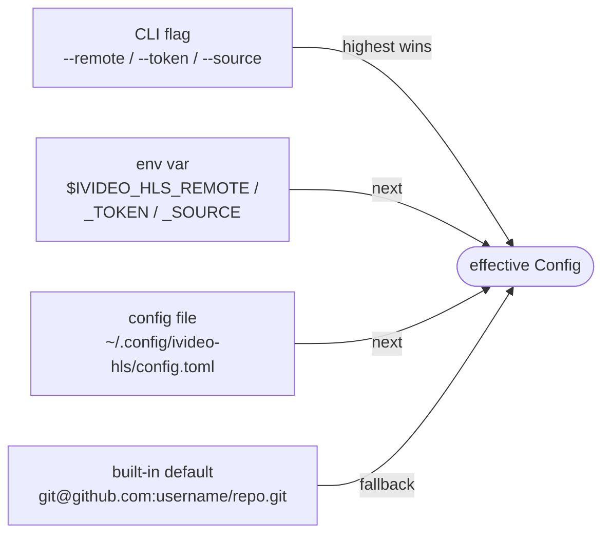

# Product Requirements Document — ivideo-hls

| | |
|---|---|
| **Status** | Living document (v1 — current implementation) |
| **Owner** | owner |
| **Last updated** | 2026-04-19 |
| **Audience** | Contributors, future maintainers |

---

## 1. Overview

`ivideo-hls` is a single-binary Go CLI that batch-converts local `.mp4` files into HLS (HTTP Live Streaming) outputs and ships each result to a git remote on a per-video branch. It is a port of an earlier Bun/TypeScript tool, rewritten in Go for a single distributable binary, better concurrency control, and a richer terminal UI.

The tool is operated by a single user from the directory where raw videos live. It assumes a trusted environment: SSH-authenticated git remote, `ffmpeg` on `PATH`, and write access to the current working directory.

## 1.1 System context

```
         ┌─────────────┐
         │   Operator  │  (interactive TUI or CI job)
         └──────┬──────┘
                │ flags / keystrokes
                ▼
    ┌───────────────────────┐
    │      ivideo-hls       │
    │   (single Go binary)  │
    └───┬────────┬─────────┬┘
        │        │         │
        ▼        ▼         ▼
   ┌────────┐ ┌─────┐ ┌────────────┐
   │ *.mp4  │ │ git │ │   ffmpeg   │
   │  cwd   │ │ SSH │ │  (PATH)    │
   └────────┘ └──┬──┘ └────────────┘
                 │
                 ▼
        ┌─────────────────┐
        │  remote: fm.git │
        │ branch per video│
        └─────────────────┘
```

## 2. Problem statement

Preparing a batch of long-form videos for HLS delivery involves repetitive, error-prone work:

- Running `ffmpeg` with the right codec, bitrate, and segmentation flags per quality tier.
- Renaming segments (`.ts` → `.married`, `.m3u8` → `.single`) so the downstream CDN/player stack accepts them.
- Committing each video's output into an isolated git workspace and force-pushing to a branch named after the source file.
- Cleaning up intermediate state without clobbering sibling jobs.
- Doing all of the above for many files at once without melting the CPU or racing on the git index.

Manually scripting this per-video is slow, fragile, and hard to observe. A dedicated tool with a live TUI, explicit concurrency limits, and deterministic cleanup removes the tedium and the footguns.

## 3. Goals / non-goals

### Goals
- Convert one or many `.mp4` files to HLS in a single invocation.
- Offer both an interactive TUI (for humans) and a plain-log mode (for CI / logs).
- Cap concurrent ffmpeg jobs and git pushes independently.
- Publish each converted video to its own branch via force-push, with a predictable branch name.
- Surface progress per job, per stage, with a unified event stream.
- Clean up intermediate workspaces and source files only on success.

### Non-goals
- Serving HLS output (no HTTP server, no CDN integration).
- Multi-bitrate / adaptive ladder output (single rendition per run).
- Encrypted HLS (AES-128, SAMPLE-AES).
- Cross-repo or multi-remote publishing in a single run.
- Windows support (POSIX shell + SSH assumptions throughout).
- Retry / resume of partially-failed jobs (failure = leave workspace, operator decides).

## 4. Users & use cases

**Primary user:** a solo operator preparing educational or product video content for a self-hosted HLS delivery stack backed by git.

**Primary use cases:**
1. "I dropped five new `.mp4`s in this folder — convert and publish all of them."
2. "Re-encode just `lesson-03.mp4` at higher quality and push again" (force-push semantics expected).
3. "Run the whole batch from a CI job with no terminal attached."

## 5. Functional requirements

### 5.1 Input discovery
- The CLI scans the current working directory for `*.mp4` files.
- The user may select a subset via the TUI checklist, via `-i <file>` (repeatable), or auto-select all via `-a`.

### 5.2 Configuration surface
- **Parallelism:** `-j N` sets max concurrent jobs. `-p` enables parallel mode (implied when `-j > 1`). Default: serial (`j=1`).
- **Quality:** `-q low|medium|high` maps to ffmpeg bitrate/resolution presets in `internal/pipeline/ffmpeg.go`. Default: `medium`.
- **Compression preset:** `-c fast|balanced|best` maps to ffmpeg `-preset`. Default: `balanced`.
- **Pre-compression:** `--compress` runs a `libx264 crf=28` pass before HLS segmentation.
- **Remote:** `--remote URL` overrides the default `git@github.com:username/repo.git`. Also readable from persistent config or `$IVIDEO_HLS_REMOTE`.
- **Auth token:** `--token STR` provides an HTTPS PAT for the push. Also readable from persistent config or `$IVIDEO_HLS_TOKEN`. When the remote URL is `https://`, the token is injected into the push URL at push time and never written to `git remote`.
- **Source folder:** `--source DIR` (or `$IVIDEO_HLS_SOURCE`, or `default_source_dir` in config) picks the directory scanned for videos. Defaults to the current working directory. When set explicitly and missing, the directory is auto-created at launch.
- **Scan surface:** videos are matched by fixed extension allowlist (`.mp4 .mov .m4v .mkv .webm .avi .3gp .3g2 .flv .wmv .ts`). `-r` / `--recursive` (or `default_recursive` in config) walks subdirectories; `.git`, `node_modules`, `hero*`, and hidden dirs are always pruned.
- **Output manifest:** alongside the per-source-directory `urls.txt`, a one-line `urls.txt` is written inside each pushed workspace (`x/urls.txt`) so the branch is self-describing.
- **Skip push:** `--no-push` commits the per-video branch locally but skips `git push`. The workspace is preserved and the source `.mp4` is kept regardless of `--keep-source`. Operator can push manually later.
- **Skip cleanup:** `--no-cleanup` keeps `hero_<name>/` on disk after success. Source `.mp4` is kept as well.
- **Keep source:** `--keep-source` skips deletion of the original `.mp4` on success (default: delete).
- **Persistent config:** `ivideo-hls --settings` (or `s` on the picker) opens a TUI editor backed by `~/.config/ivideo-hls/config.toml`. Stores remote URL, auth method, token, and run defaults. File mode is `0600`.
- **Output manifest:** after each successful push, ivideo-hls appends one line to `urls.txt` in the video's source directory. Content is the rendered **Playback URL** (HTTP(S) pattern used by viewers, distinct from the SSH/HTTPS **Push URL** used by git — placeholders: `{branch}`, `{filename}`) or the local workspace path when no pattern is configured. Writes are mutex-guarded so parallel jobs sharing a directory don't interleave. Manifest failures are warnings, never failures.


- **Output mode:** `--no-tui` forces plain-log output.

### 5.2.1 Configuration precedence



The token is stored plaintext at `0600`. The settings screen labels the current token source (*from config*, *from $IVIDEO_HLS_TOKEN*, *not set*) and supports a test-connection action (`t`) that runs `git ls-remote` against the configured remote with a 10-second timeout.

### 5.3 Per-video pipeline
For each selected video, run these stages in order:

| # | Stage | Behavior |
|---|---|---|
| 1 | `workspace` | Copy the base `hero/` repo into `hero_<sanitized>/`, point its `origin` at the configured remote. |
| 2 | `branch` | `git checkout -B <videoBasename>` — always reset, divergence is expected. |
| 3 | `compress` *(optional)* | `libx264 preset=medium crf=28` → `<name>_compressed.mp4`, fed into the next stage. |
| 4 | `convert` | HLS via `libx264 + aac`, segments `index_NNN.ts`, playlist `index.m3u8`. |
| 5 | `rename` | `.ts → .married`, rewrite playlist entries, `.m3u8 → .single`. |
| 6 | `push` | `git add . && git commit -m "a" && git push -u -f origin <branch>`. |
| 7 | `cleanup` | Remove `hero_<sanitized>/` and delete the original `.mp4`. Only runs on success. |

```
 lesson-01.mp4
      │
      ▼
┌───────────┐   clone base hero/ → hero_lesson-01/
│ workspace │   set remote → git@github.com:username/repo.git
└─────┬─────┘
      ▼
┌───────────┐   git checkout -B lesson-01  (force reset)
│  branch   │
└─────┬─────┘
      ▼
┌───────────┐   [optional] libx264 crf=28
│ compress  │   → lesson-01_compressed.mp4
└─────┬─────┘
      ▼
┌───────────┐   libx264 + aac
│  convert  │   → index.m3u8 + index_NNN.ts
└─────┬─────┘
      ▼
┌───────────┐   *.ts → *.married
│  rename   │   index.m3u8 → index.single (refs rewritten)
└─────┬─────┘
      ▼
┌───────────┐   git add . && commit -m "a"
│   push    │   git push -u -f origin lesson-01
└─────┬─────┘
      ▼
┌───────────┐   rm -rf hero_lesson-01/
│  cleanup  │   rm lesson-01.mp4       (success only)
└─────┬─────┘
      ▼
    ✓ done
```

**Branch naming is invariant:** `basename(video) − ".mp4"`. Sanitization (spaces, case, etc.) is applied only to the workspace directory, not the branch.

**Rename step is invariant:** downstream players expect `.married` / `.single`. Do not change without a paired downstream update.

**Force-push is invariant:** each branch is owned by one source video; divergence is expected on re-runs.

### 5.4 Concurrency
- `cpuSem`: `maxParallel` slots, guards ffmpeg work (compress + convert).
- `netSem`: `maxParallel * 2` slots, guards `git push`.
- Workspace clone runs outside both semaphores so I/O can overlap ffmpeg work.
- `prepareBaseHero` is mutex-guarded and runs exactly once before fan-out.
- Both semaphores are atomically instrumented; `Runner.Usage()` returns a `SlotUsage` snapshot (CPU/NET in-use vs capacity) and the TUI renders it live on the run dashboard header every 500 ms.
- Default parallelism is configurable via `default_parallel` in the settings file (flag > env > file > serial fallback).

```
                      prepareBaseHero  (mutex, runs once)
                              │
                              ▼
              ┌───────────────┴───────────────┐
              │         fan-out per video      │
              └───┬───────────┬───────────┬───┘
                  │           │           │
             ┌────▼────┐ ┌────▼────┐ ┌────▼────┐
             │ job #1  │ │ job #2  │ │ job #N  │
             └─┬──────┬┘ └─┬──────┬┘ └─┬──────┬┘
               │      │    │      │    │      │
   workspace ──┘      │    │      │    │      │  (no semaphore — I/O overlaps)
                      ▼    │      ▼    │      ▼
                ┌──────────┴──────────────────────┐
   compress ──► │    cpuSem   (maxParallel slots) │  ffmpeg throttle
   convert  ──► │                                 │
                └──────────┬──────────────────────┘
                           │
                           ▼
                ┌──────────┴──────────────────────┐
   push     ──► │    netSem  (maxParallel×2)      │  git push throttle
                └─────────────────────────────────┘
```

### 5.5 Observability
- All pipeline output flows through `pipeline.Emitter` — no direct `fmt.Println` from pipeline code.
- Events carry `{Job, Stage, Level, Message, Percent}`. Stages map to progress-bar percentages via `stageProgress`.
- **TUI mode:** Bubble Tea screen with per-job progress bars, a stage badge, and the last 10 activity lines, color-coded by level.
- **Plain mode:** `[job] message` per line, newline-flushed, suitable for CI logs.

### 5.6 Cancellation & exit codes
- `ctrl+c` cancels in-flight ffmpeg and git processes via `exec.CommandContext`.
- `q` in the TUI exits only after all jobs reach a terminal state.
- Process exits `0` only if every selected video reached `done`. Any `failed` job → exit `1`.

### 5.7 Failure handling
- On failure, the `hero_<sanitized>/` workspace is **preserved** for inspection.
- The original `.mp4` is **not** deleted on failure.
- The failing job's stage and error message are surfaced in the TUI / log; other jobs continue.

## 6. Non-functional requirements

- **Platform:** macOS and Linux. No Windows support.
- **Runtime dependencies:** `git` on `PATH` (hard); `ffmpeg` + `ffprobe` either resolvable via the deps cache (`ivideo-hls install-deps`) or on `PATH`; SSH key or HTTPS+PAT configured for the remote.
- **Dependency bootstrap:** `ivideo-hls install-deps` downloads pinned static ffmpeg/ffprobe builds from canonical upstream mirrors (evermeet.cx for macOS, johnvansickle.com for Linux), verifies SHA-256 checksums committed in `internal/deps/sources.go`, and installs to `$XDG_CACHE_HOME/ivideo-hls/bin/`. ivideo-hls never redistributes ffmpeg.
- **Diagnostics:** `ivideo-hls doctor` runs read-only setup checks (binary presence + version, git, config file + perms, remote URL, auth/URL consistency, token source, SSH agent keys, source dir, remote reachability, playback URL shape, pending retries) and reports each as OK/warn/fail with a remediation hint. Exit code is 1 when any check fails; warnings pass.
- **Recovery (post-encode push failure):** `ivideo-hls retry-failed` finds `hero_<name>/` workspaces left by a failed run, lists them with sizes, prompts for confirmation (skip with `-y`), and force-pushes each without re-encoding. A candidate qualifies when it has a `.git`, `x/index.single`, a branch matching the sanitized name, and unpushed commits.
- **Recovery (mid-encode failure):** `ivideo-hls resume-failed` finds workspaces that stopped before the playlist was finalized (stuck in compress, convert, or pre-rename), deletes the partial workspace and any `_compressed.mp4` sibling, then drives the full pipeline again from the original source. Workspaces whose source `.mp4` is missing are listed but skipped — no safe way to resume without the source. Mid-stage ffmpeg resume is deliberately not attempted: ffmpeg has no safe native resume for single-file outputs and partial segments would risk publishing corrupt playlists.
- **Resume policy (opt-in compress reuse):** `resume_reuse_compressed` in settings (default off) lets `resume-failed` skip the compress stage when a clean `_compressed.mp4` sibling is present (size > 1 KiB, ffprobe duration > 1s, and **no `_compressed.partial.mp4` sibling**). Compress writes to `_compressed.partial.mp4` first and renames atomically on clean exit, so a `.partial` presence means "last compress was killed" and the file is always re-encoded. Convert and rename remain fully re-run — segment output is never trusted across runs.
- **Credential hygiene:** tokens and `https://TOKEN@host/…` URLs are scrubbed from error messages and logs before any emit. Push failures surface the host and branch but never the secret; the settings screen and doctor mask stored tokens when displaying them.
- **Build:** `go build ./...` produces a single static binary. Go 1.25+.
- **Latency:** TUI redraws at Bubble Tea's default tick rate; per-event cost must stay O(1) in the emitter.
- **Resource bounds:** concurrent ffmpeg processes never exceed `maxParallel`; concurrent git pushes never exceed `maxParallel * 2`.
- **Determinism:** identical inputs + config should produce identical branch names and file layouts. ffmpeg output is not bit-identical across runs and that is acceptable.

## 7. Architecture summary

See [`docs/ARCHITECTURE.md`](ARCHITECTURE.md) for the layered diagram and package-by-package responsibilities. High-level:

- `cmd/ivideo-hls` — Cobra CLI, prereq checks, TUI vs plain dispatch.
- `internal/pipeline` — config, events/emitter, exec wrappers, git helpers, workspace lifecycle, ffmpeg stages, `Runner` orchestrator.
- `internal/tui` — Bubble Tea picker (two screens) and live run screen, with all colors in `styles.go`.

```
┌─────────────────────────────────────────────────────────────┐
│  cmd/ivideo-hls   (Cobra • flag parsing • prereq checks)    │
└──────────────┬──────────────────────────┬───────────────────┘
               │                          │
        ┌──────▼──────┐            ┌──────▼──────┐
        │ internal/tui│            │  runPlain   │
        │ (Bubble Tea)│            │  (CI logs)  │
        └──────┬──────┘            └──────┬──────┘
               │       pipeline.Emitter   │
               └──────────────┬───────────┘
                              ▼
               ┌──────────────────────────┐
               │    internal/pipeline     │
               │                          │
               │  Runner.Run              │
               │   ├── prepareBaseHero    │
               │   ├── setupWorkspace     │
               │   ├── compressVideo      │
               │   ├── convertToHLS       │
               │   ├── rename segments    │
               │   ├── git commit / push  │
               │   └── cleanup            │
               └──────┬─────────┬─────────┘
                      │         │
              ┌───────▼──┐   ┌──▼────┐   ┌────┐
              │  ffmpeg  │   │  git  │   │ fs │
              └──────────┘   └───────┘   └────┘
```

### Event flow

```
  pipeline stage ──► Emitter.Emit(Event)
                          │
                ┌─────────┴─────────┐
                ▼                   ▼
         TUI run screen        plain writer
         (progress bars,       "[job] message"
          activity log)
```

## 8. Assumptions & constraints

- A `hero/` base repo exists (or will be created) in the working directory and is treated as a clean template for each per-video workspace.
- The git remote accepts force-pushes to any branch, and the user's SSH key is authorized.
- Source `.mp4` files are owned by the user running the tool — deletion on success is intentional.
- A directory named exactly `hero` is sacred; only `prepareBaseHero` may write to it. Sibling `hero_*` directories are disposable.
- Colors are centralized in `internal/tui/styles.go`; inline `lipgloss.Color(...)` elsewhere is a bug.

## 9. Open questions / future work

- **Adaptive bitrate ladder:** emit 480p/720p/1080p variants with a master playlist. Would require a new stage and a richer rename pass.
- **Resume on failure:** detect partial state in `hero_<sanitized>/` and pick up at the next stage instead of re-cloning.
- **Thumbnail generation:** add a `thumbnail` stage (see `ARCHITECTURE.md` "Adding features").
- **Windows support:** would require rewriting workspace copy and SSH assumptions — not currently on the roadmap.
- **Test suite:** there are no tests yet (`go test ./...` runs clean but empty). A table-driven test for `ffmpeg.go` argument construction and a fake-exec harness for `processor.go` would be the first targets.

## 10. References

- [`README.md`](../README.md) — quick-start and flag table.
- [`docs/ARCHITECTURE.md`](ARCHITECTURE.md) — package layout and data flow.
- [`docs/USAGE.md`](USAGE.md) — operator guide and troubleshooting.
