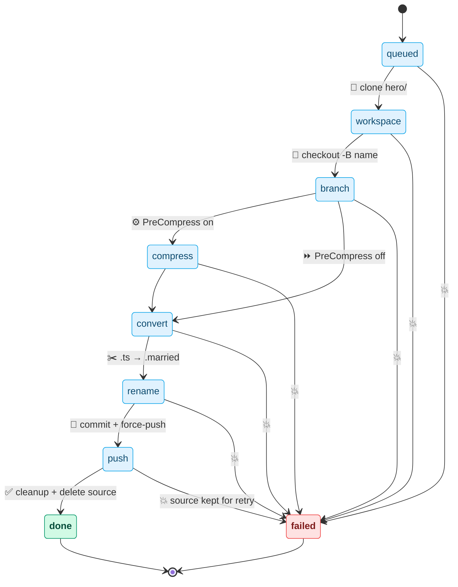
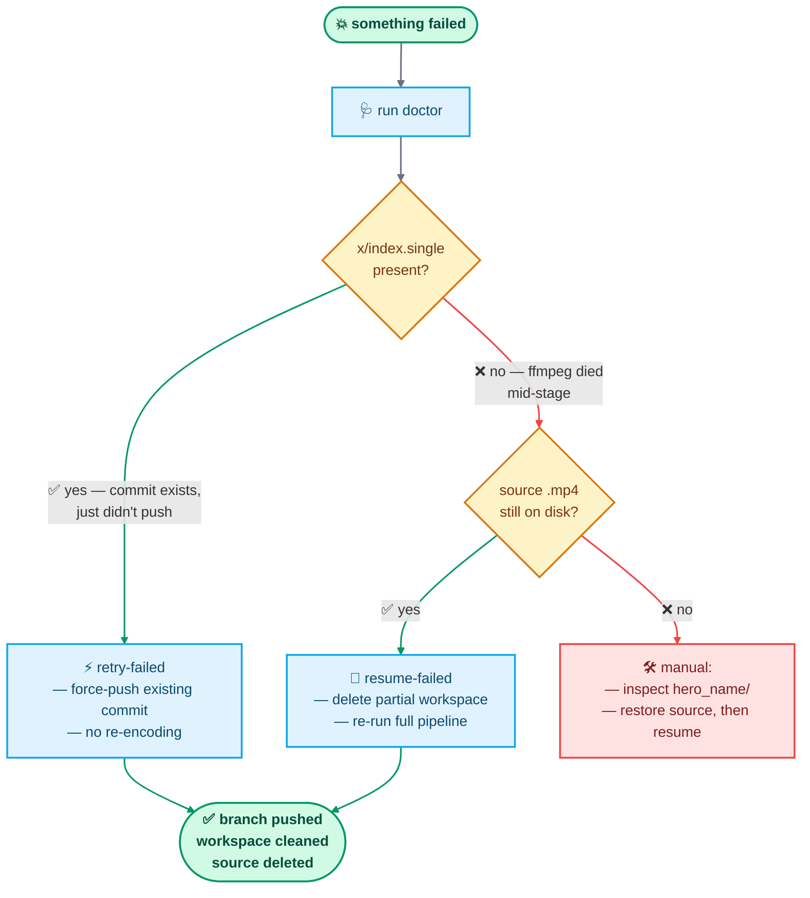

# Process — end-to-end lifecycle

This doc is the single source of truth for *what happens when you run
ivideo-hls*. The README and PRD link here instead of duplicating it.

---

## The headline: mp4 → HLS → git

Each `.mp4` in `./input/` becomes a branch on your configured remote
carrying the HLS playlist (`x/index.single`) and its segments
(`x/*.married`). A player then fetches the playlist from the Playback
URL (an HTTP(S) template you configure).

```mermaid
flowchart LR
    %% 🟠 source  🟢 processing  🔵 git  🟣 player
    src["📂 ./input/\nlesson-01.mp4"]
    enc["⚙️ ffmpeg\ncompress → HLS"]
    rename["✂️ rename\n.ts → .married\n.m3u8 → .single"]
    commit["📝 git commit\nbranch: lesson-01"]
    push["🚀 force-push\nto remote"]
    branch["🌿 remote branch\nlesson-01\nx/index.single + *.married"]
    player["▶️ HLS player\nfetches via Playback URL"]

    src    --> enc
    enc    --> rename
    rename --> commit
    commit --> push
    push   --> branch
    branch --> player

    classDef srcStyle    fill:#FEF3C7,stroke:#D97706,stroke-width:2px,color:#78350F;
    classDef procStyle   fill:#D1FAE5,stroke:#059669,stroke-width:2px,color:#064E3B;
    classDef gitStyle    fill:#E0F2FE,stroke:#0EA5E9,stroke-width:2px,color:#0C4A6E;
    classDef playerStyle fill:#EDE9FE,stroke:#7C3AED,stroke-width:2px,color:#3B0764;

    class src srcStyle;
    class enc,rename procStyle;
    class commit,push,branch gitStyle;
    class player playerStyle;

    linkStyle 0,1 stroke:#D97706,stroke-width:1.8px;
    linkStyle 2,3 stroke:#059669,stroke-width:1.8px;
    linkStyle 4,5 stroke:#0EA5E9,stroke-width:1.8px;
```



---

## Per-video state machine



On any failure, two things **stay on disk**:

- `hero_<name>/` — the per-video workspace (with whatever finished).
- `./input/<name>.mp4` — the source video.

This is the foundation the recovery commands build on.

---

## Three ways a batch starts

### 1. Fresh batch — `./ivideo-hls`

The normal case. Scans `./input/` (or the configured source), picks
videos via the TUI, runs the full pipeline. Nothing on disk from prior
runs matters.

### 2. Continuing a batch where everything went fine

Same command. Previously-successful videos are already gone from
`./input/` (deleted on success), so they're invisible to the picker.
Only new drops appear.

### 3. Continuing a batch that had failures

This is the interesting case — **the tool never auto-recovers on a
normal run**. That's deliberate: surprise re-encodes of 30-minute
videos are worse than making the operator type a verb.

Run `./ivideo-hls doctor` first — it lists both classes of leftover:

```
!  pending retries          4 workspace(s) waiting: lesson-01, lesson-02, …
                             ↳ run `ivideo-hls retry-failed` to finish them
!  incomplete workspaces    1 stopped mid-pipeline: lesson-05 (convert)
                             ↳ run `ivideo-hls resume-failed` to delete and re-run from source
```

Then pick the right command.

---

## Pick the right recovery command



**retry-failed** — fast path. Works when encoding finished but push
didn't. Uses the commit already in the workspace; force-pushes; cleans
up on success. No ffmpeg.

**resume-failed** — slow path. Works when ffmpeg died mid-encode.
Deletes the partial `hero_<name>/` + any `_compressed.mp4` sibling, then
re-runs the pipeline from the original source. Skips candidates whose
source is missing — no safe way to reconstruct.

**normal run** — for everything else. New videos, new batch, clean slate.

---

## An example, step by step

Say yesterday you ran:

```bash
cp ~/Downloads/lesson-{01,02,03,04,05}.mp4 ./input/
./ivideo-hls -a -p -j 2
```

Partway through, a `git push` failed on `lesson-03` (bad PAT) and your
SSH agent dropped keys so `lesson-04`'s push also failed. Then your
battery died mid-encode of `lesson-05`. The others pushed fine.

On disk this morning:

```
./input/
  lesson-03.mp4   ← kept because push failed
  lesson-04.mp4   ← kept because push failed
  lesson-05.mp4   ← kept because encode didn't finish
  (01, 02 gone — pushed cleanly)

./hero_lesson-03/   ← x/index.single present, commit ready
./hero_lesson-04/   ← x/index.single present, commit ready
./hero_lesson-05/   ← x/ has .ts files, no index.single
```

Workflow:

```bash
# 1. Diagnose: one command tells you what's waiting and why
./ivideo-hls doctor
# → remote reachable warns about ssh agent; pending retries: 03, 04;
#   incomplete workspaces: 05 (convert)

# 2. Fix the environment (re-add SSH keys, rotate PAT, whatever)
ssh-add ~/.ssh/id_ed25519

# 3. Fast path: push what's ready
./ivideo-hls retry-failed
# → pushes 03 and 04, cleans them up, deletes their sources

# 4. Slow path: restart what never finished
./ivideo-hls resume-failed
# → deletes hero_lesson-05/ + any lesson-05_compressed.mp4,
#   re-runs the full pipeline against ./input/lesson-05.mp4
```

After step 4, `./input/` is empty, all five branches are on the remote,
and `doctor` is all green.

---

## Lifetime of `_compressed.mp4`

The compressed file survives every stage between compress and push. It is
only deleted when **the whole job succeeds end-to-end** — push landed,
workspace cleanup is enabled, and `--keep-source` is off. Any of these
keep it alive:

| Condition | Effect |
|---|---|
| Push failed | File kept |
| `--no-push` set | File kept |
| `--no-cleanup` set | File kept |
| `--keep-source` set | File kept |

That mirrors the rule for the source `.mp4` exactly, and it's what makes
the opt-in **Reuse compressed on resume** policy work: after a push
failure, the clean `_compressed.mp4` is still on disk, paired with a
still-present source, ready for `resume-failed` to skip the compress
stage.

---

## In-progress filename discipline

Each stage writes its output to a `.partial`-suffixed name first, then
renames atomically on clean exit. This means:

- A crash anywhere mid-stage leaves a visible `.partial` file on disk.
- `doctor` and the operator can see exactly which stage was interrupted
  without trusting what the tool remembers.
- Clean outputs never share a filename with killed ones.

> Today only compress uses this (`<name>_compressed.partial.mp4`).
> Convert and rename either write atomically per-segment (ffmpeg) or
> use `os.Rename` (the `.ts → .married` step), so no additional
> `.partial` discipline is needed there.

---

## Resume policy: reuse compressed (opt-in)

`resume-failed` always redoes every stage by default — slower, but
always correct. For large batches where only convert/push failed, the
setting **Reuse compressed on resume** (TOML key
`resume_reuse_compressed`, default off) tells `resume-failed` to keep a
`_compressed.mp4` it finds next to the source if **all** of these hold:

1. the file is bigger than 1 KiB
2. `ffprobe` reports a duration greater than 1 second
3. **no `_compressed.partial.mp4` sibling exists**

Condition 3 is load-bearing: the pipeline only ever renames to the
final name after ffmpeg exits zero. If a `.partial` is present, the
last compress was killed and the final file (if any) is stale.

When the policy kicks in for a video, `resume-failed`:

- deletes only the `hero_<name>/` workspace (keeps the compressed file),
- runs that video with `PreCompress = false` and the compressed file as
  input, so the pipeline goes straight to convert.

Videos whose compressed sibling fails the integrity check are processed
with the normal "delete everything, redo" path in the same command.
The confirmation prompt tells you which bucket each candidate lands in
before you agree.

Convert and rename are deliberately never skipped — segment output is
not safely resumable without risking corrupt playlists.

---

## What the tool will never do

| Behaviour | Reason |
|---|---|
| 🚫 Silently resume on a normal run | If you have pending work, the normal run ignores it. Recovery is explicit. |
| 🚫 Resume mid-ffmpeg | ffmpeg has no safe native resume for single-file outputs. Partial HLS segments could publish corrupt playlists. Delete-and-redo is slower but always correct. |
| 🚫 Delete sources when recovery might still be possible | The source `.mp4` is only deleted when push *and* cleanup both succeed on the same run. Skipping either keeps the source. |

---

## Related docs

- [`ARCHITECTURE.md`](ARCHITECTURE.md) — package layout, event surface, invariants.
- [`PRD.md`](PRD.md) — functional + non-functional requirements.
- [`../README.md`](../README.md#recovering-from-a-failed-run) — command-line reference.
