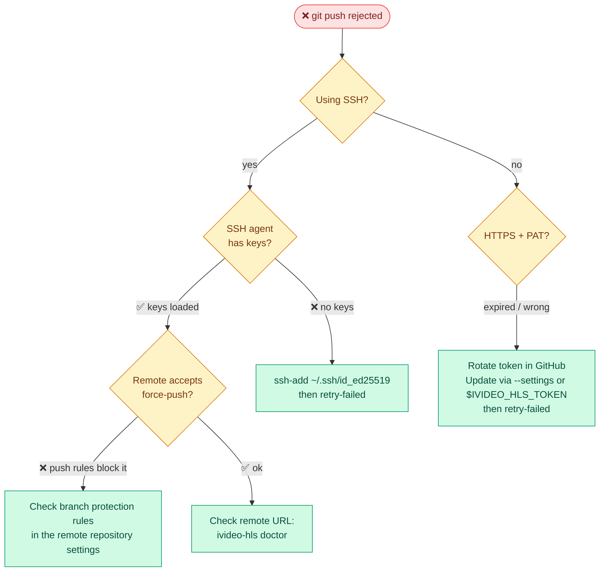

# Troubleshooting

Quick diagnosis — always start here:

```bash
./ivideo-hls doctor
```

`doctor` runs every read-only check and prints a ✓/!/✗ report with a fix hint. If it's green, the environment is healthy.

---

## Common issues

### ffmpeg not found

**Symptom:**
```
✗  ffmpeg    not found on PATH or in cache
```

**Fix:**
```bash
# Download and cache a pinned static build (no sudo needed)
./ivideo-hls install-deps

# Verify
./ivideo-hls doctor
```

Or install system-wide:
```bash
brew install ffmpeg        # macOS
apt install ffmpeg         # Debian / Ubuntu
```

---

### git push rejected

**Symptom:**
```
[lesson-03] git push: exit status 1
error: failed to push some refs
```

**Causes and fixes:**



After fixing auth, use `retry-failed` — no re-encoding needed:
```bash
./ivideo-hls retry-failed
```

---

### SSH agent has no keys

**Symptom** (from `doctor`):
```
!  ssh keys    agent has no keys loaded
               ↳ ssh-add ~/.ssh/id_ed25519 (or your key)
```

**Fix:**
```bash
ssh-add ~/.ssh/id_ed25519   # or your actual key path
ssh -T git@github.com       # verify: should print "Hi username!"
```

To load keys automatically on login, add to `~/.zshrc` / `~/.bash_profile`:
```bash
ssh-add --apple-use-keychain ~/.ssh/id_ed25519   # macOS
```

---

### ffmpeg is very slow / CPU overloaded

**Symptom:** encoding speed drops below `0.5x`, system becomes unresponsive.

**Fix:** Reduce parallel jobs:
```bash
./ivideo-hls -a -j 1        # serial — one encode at a time
./ivideo-hls -a -j 2        # two parallel (recommended for most machines)
```

The CPU semaphore hard-caps concurrent ffmpeg processes to `-j N`. The push pool runs independently at `2× N` so it never blocks encodes.

---

### Workspace left on disk after crash

**Symptom:** `hero_lesson-05/` directory exists after a failed run.

This is **by design** — ivideo-hls preserves the workspace so you don't lose work.

**What to do:**
```bash
# 1. See what's waiting
./ivideo-hls doctor

# 2a. If playlist is ready (push failed only)
./ivideo-hls retry-failed

# 2b. If ffmpeg died mid-encode
./ivideo-hls resume-failed

# 2c. Manual inspection, then clean up yourself
ls hero_lesson-05/x/
rm -rf hero_lesson-05/
```

See [PROCESS.md](PROCESS.md#pick-the-right-recovery-command) for the full decision tree.

---

### Source .mp4 missing but workspace exists

**Symptom** (from `resume-failed`):
```
⚠ lesson-05 — source .mp4 not found, skipping
```

**Cause:** The source file was deleted manually, or never existed for that workspace.

**Fix:** Restore the original `.mp4` and re-run `resume-failed`, or delete the workspace manually:
```bash
rm -rf hero_lesson-05/
```

---

### `doctor` reports config file not present

**Symptom:**
```
!  config file    not present — defaults in use
                   ↳ press `s` in the picker or run with --settings
```

This is a warning, not an error. The tool runs fine with built-in defaults.

**Fix** (optional — save your settings permanently):
```bash
./ivideo-hls --settings
# press `s` to save
```

---

### Remote URL is unreachable

**Symptom:**
```
✗  remote reachable    git ls-remote failed (timeout 10s)
```

**Checks:**
```bash
# Test SSH connectivity
ssh -T git@github.com

# Test the remote directly
git ls-remote git@github.com:org/repo.git

# Check the configured URL
./ivideo-hls doctor
```

**Common causes:**
- Wrong remote URL in config — fix via `--settings`
- No network / VPN required
- SSH key not authorized on the remote host

---

### Token visible in error output

ivideo-hls scrubs tokens and `https://TOKEN@host` URLs from all log lines before emitting them. If you see a raw token in output, please open an issue.

As a precaution, revoke and rotate the token immediately in your git host's settings, then update it:
```bash
export IVIDEO_HLS_TOKEN=ghp_newtoken
# or via --settings
```

---

### Build fails: wrong Go version

**Symptom:**
```
go: go.mod requires go >= 1.25
```

**Fix:**
```bash
go version          # check current
# Install Go 1.25+ from https://go.dev/dl/
go build ./...      # retry
```

---

## Windows

> [!WARNING]
> ivideo-hls has **no native Windows support**. It relies on POSIX shell assumptions, SSH agent behaviour, and `os.Rename` semantics that differ on Windows. Running the binary directly on Windows is unsupported and untested.

### Recommended: WSL2 (Windows Subsystem for Linux)

WSL2 gives you a full Linux environment on Windows and is the supported path.

**Step 1 — Install WSL2**

Open PowerShell as Administrator:

```powershell
wsl --install
# Restart when prompted
```

This installs Ubuntu by default. After restart, launch **Ubuntu** from the Start menu and complete the first-run setup.

**Step 2 — Install Go inside WSL2**

```bash
wget https://go.dev/dl/go1.25.linux-amd64.tar.gz
sudo tar -C /usr/local -xzf go1.25.linux-amd64.tar.gz
echo 'export PATH=$PATH:/usr/local/go/bin' >> ~/.bashrc
source ~/.bashrc
go version   # should print go1.25+
```

**Step 3 — Install git**

```bash
sudo apt update && sudo apt install -y git
git config --global user.name "Your Name"
git config --global user.email "you@example.com"
```

**Step 4 — Set up SSH key**

```bash
ssh-keygen -t ed25519 -C "you@example.com"
cat ~/.ssh/id_ed25519.pub   # copy → add to GitHub Settings → SSH keys
ssh -T git@github.com       # verify: should print "Hi username!"
```

**Step 5 — Build and run ivideo-hls**

```bash
git clone git@github.com:iblogger855/ivideo-hsl.git
cd ivideo-hsl
go build -o ivideo-hls ./cmd/ivideo-hls
./ivideo-hls install-deps   # download ffmpeg + ffprobe
./ivideo-hls doctor         # verify environment
./ivideo-hls                # run
```

**Accessing Windows files from WSL2**

Your Windows drives are mounted under `/mnt/`:

```bash
# Copy videos from Windows Downloads into WSL2 input folder
cp /mnt/c/Users/YourName/Downloads/*.mp4 ./input/
```

### Alternative: Docker

If you prefer not to use WSL2, run ivideo-hls inside a Linux container:

```dockerfile
FROM golang:1.25-bookworm
WORKDIR /app
COPY . .
RUN go build -o ivideo-hls ./cmd/ivideo-hls
```

```powershell
docker build -t ivideo-hls .
docker run --rm -v C:\Videos:/app/input -it ivideo-hls ./ivideo-hls -a --no-tui
```

> [!NOTE]
> SSH auth inside Docker requires forwarding your SSH agent into the container. See [Docker SSH agent forwarding](https://docs.docker.com/engine/security/ssh/) for details.

---

## Still stuck?

1. Run `./ivideo-hls doctor` and copy the full output.
2. Check [PROCESS.md](PROCESS.md) for the recovery decision tree.
3. Open an issue on GitHub with the doctor output and the error message.
