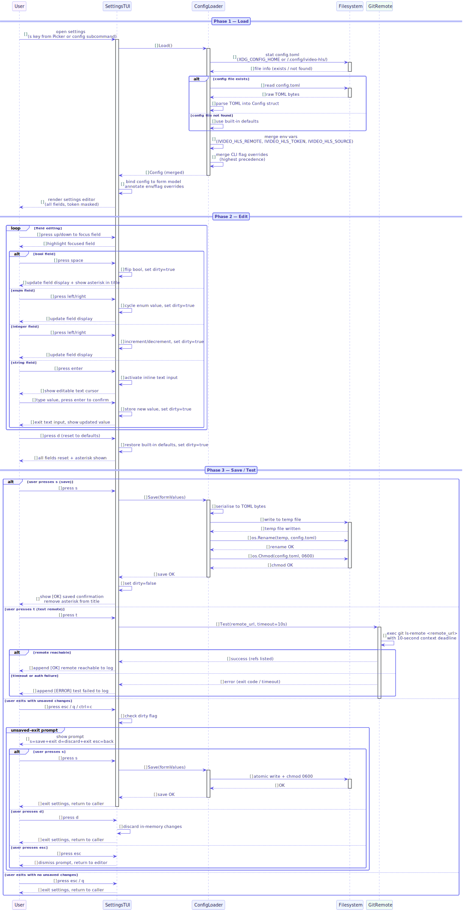

# FS-CONFIG-01 — Persistent Settings Flow

## Table of Contents

1. [Meta Information](#1-meta-information)
2. [Description & Use Case](#2-description--use-case)
3. [Pre-conditions & Post-conditions](#3-pre-conditions--post-conditions)
4. [Screen Contracts](#4-screen-contracts)
   - [4.1 Screen 1 — Settings Editor](#41-screen-1--settings-editor)
5. [Config Schema Reference](#5-config-schema-reference)
6. [Key Bindings Reference](#6-key-bindings-reference)
7. [Configuration Precedence Chain](#7-configuration-precedence-chain)
8. [Security Handling](#8-security-handling)
9. [State Machine](#9-state-machine)
10. [Technical Sequence Flow](#10-technical-sequence-flow)
11. [Change History](#11-change-history)

---

## 1. Meta Information

| Field      | Value                    |
|------------|--------------------------|
| Flow ID    | FS-CONFIG-01             |
| Subdomain  | Persistent Settings      |
| Status     | Approved                 |
| Version    | 1.0.0                    |
| Created    | 2026-06-17               |
| Author     | ichamrong                |

---

## 2. Description & Use Case

This flow covers reading, editing, testing, and saving the persistent application configuration for `ivideo-hls`. The settings TUI is accessible from the Video Picker screen (`s` key) and governs all default pipeline parameters, git remote configuration, and authentication.

**Primary actors:** Developer configuring the tool for the first time or updating remote/auth settings.

**Entry points:**
- `s` key from the Video Picker (FS-TUI-01, Screen 1).
- `ivideo-hls config` subcommand (opens the settings TUI directly).

**Exit points:**
- Save and exit (`s`).
- Discard and exit (`d` at the unsaved-changes prompt).
- Return to caller without saving (`esc` at the prompt, or `esc`/`q` with no changes).

---

## 3. Pre-conditions & Post-conditions

### Pre-conditions

- The config directory (`$XDG_CONFIG_HOME/ivideo-hls/` or `~/.config/ivideo-hls/`) is writable by the current user, or will be created on first save.
- The user has a git remote URL available (required for push; `default_no_push=true` bypasses runtime remote checks).

### Post-conditions

- **Save:** `config.toml` is written atomically (write to temp file, `os.Rename`) with permissions `0600`. The in-memory config is reloaded for the remainder of the session.
- **Discard:** No file is modified. The session continues with the previously loaded config.
- **Test remote:** No files are modified. The result of `git ls-remote <remote>` (10-second timeout) is displayed as an `[OK]` or `[ERROR]` log entry.

---

## 4. Screen Contracts

### 4.1 Screen 1 — Settings Editor

**Purpose:** Provide an in-TUI form for viewing and editing all persistent configuration fields.

**Layout:**

```
┌─────────────────────────────────────────────────────────────┐
│ Settings                                      [s]ave [t]est  │
├──────────────────────────────────────────────────────────────┤
│  Remote URL         git@github.com:user/repo.git            │
│  Auth method        [ ssh ]                                  │
│  Token              ••••••••••••••••  (masked)              │
│  Playback URL       https://cdn.example.com/{branch}/{file} │
│  Source dir         ~/Videos                                 │
│  Recursive          [ ] disabled                             │
│                                                              │
│ ── Pipeline Defaults ───────────────────────────────────     │
│  Parallel           [  2  ]                                  │
│  Quality            [ medium ]                               │
│  Compression        [ balanced ]                             │
│  Pre-compress       [ ] disabled                             │
│  Keep source        [ ] disabled                             │
│  No push            [ ] disabled                             │
│  No cleanup         [ ] disabled                             │
│  Resume reuse comp. [ ] disabled                             │
├──────────────────────────────────────────────────────────────┤
│  [d] reset defaults   [t] test remote   [esc] back / quit    │
└─────────────────────────────────────────────────────────────┘
```

**Token masking:** The `token` field is always rendered as `••••••••••••••••` regardless of value length. The raw value is held in memory and written to disk only on save. It is never displayed in plaintext in the TUI.

**Auth method toggle:** When `auth_method = https`, the `token` field becomes editable (pressing `enter` activates a text input). When `auth_method = ssh`, the token field is read-only and greyed out.

**Unsaved-changes indicator:** A `*` is appended to the header line title when there are unsaved modifications (e.g., `Settings *`).

**Unsaved-exit prompt (displayed when leaving with unsaved changes):**

```
┌────────────────────────────────────┐
│  You have unsaved changes.         │
│  [s] save + exit                   │
│  [d] discard + exit                │
│  [esc] back to settings            │
└────────────────────────────────────┘
```

---

## 5. Config Schema Reference

**File location:**
- Primary: `$XDG_CONFIG_HOME/ivideo-hls/config.toml`
- Fallback: `~/.config/ivideo-hls/config.toml`

**File permissions:** `0600` (owner read/write only; enforced on every write).

**Full schema:**

| Field                  | Type              | Default                              | Description                                                     |
|------------------------|-------------------|--------------------------------------|-----------------------------------------------------------------|
| `remote_url`           | string            | `git@github.com:username/repo.git`   | Git push destination                                            |
| `auth_method`          | `ssh` \| `https`  | `ssh`                                | Authentication protocol for git operations                      |
| `token`                | string            | `""`                                 | HTTPS Personal Access Token; masked in TUI, stored plaintext at 0600 |
| `playback_url`         | string            | `""`                                 | URL template; placeholders: `{branch}`, `{filename}`, `{subdir}` |
| `default_source_dir`   | string            | `""`                                 | Source folder for video files; falls back to cwd if empty       |
| `default_recursive`    | bool              | `false`                              | Walk subdirectories when scanning for video files               |
| `default_parallel`     | int               | `1`                                  | Maximum number of concurrent pipeline jobs                      |
| `default_quality`      | `low` \| `medium` \| `high` | `medium`               | Video quality preset applied to ffmpeg encoding                 |
| `default_compression`  | `fast` \| `balanced` \| `best` | `balanced`           | ffmpeg `-preset` value for encoding speed/compression trade-off |
| `default_precompress`  | bool              | `false`                              | Run a libx264 `crf=28` pass before HLS segmentation            |
| `default_keep_source`  | bool              | `false`                              | Keep the original source file on successful completion          |
| `default_no_push`      | bool              | `false`                              | Commit locally but skip the `git push` step                     |
| `default_no_cleanup`   | bool              | `false`                              | Retain the workspace directory on successful completion         |
| `resume_reuse_compressed` | bool           | `false`                              | On resume, reuse an existing clean `_compressed.mp4` instead of re-encoding |

**Example `config.toml`:**

```toml
remote_url            = "git@github.com:username/repo.git"
auth_method           = "ssh"
token                 = ""
playback_url          = "https://cdn.example.com/{branch}/{filename}"
default_source_dir    = ""
default_recursive     = false
default_parallel      = 1
default_quality       = "medium"
default_compression   = "balanced"
default_precompress   = false
default_keep_source   = false
default_no_push       = false
default_no_cleanup    = false
resume_reuse_compressed = false
```

---

## 6. Key Bindings Reference

### Settings Editor

| Key(s)          | Action                                                                 |
|-----------------|------------------------------------------------------------------------|
| `↑` / `k`       | Move focus to previous field                                           |
| `↓` / `j`       | Move focus to next field                                               |
| `←` / `h`       | Cycle enum value backwards / decrement integer                         |
| `→` / `l`       | Cycle enum value forwards / increment integer                          |
| `space`         | Toggle boolean field                                                   |
| `enter`         | Begin text edit on focused string field / toggle `auth_method`         |
| `s`             | Save current values to `config.toml` (atomic write, perms 0600)       |
| `t`             | Test remote: run `git ls-remote <remote_url>` with 10-second timeout   |
| `d`             | Reset all fields to built-in defaults (marks as unsaved)               |
| `esc` / `q` / `ctrl+c` | Exit settings; if unsaved changes: show prompt (s/d/esc)       |

### Unsaved-Exit Prompt

| Key   | Action                      |
|-------|-----------------------------|
| `s`   | Save to disk and exit        |
| `d`   | Discard changes and exit     |
| `esc` | Dismiss prompt, return to editor |

---

## 7. Configuration Precedence Chain

Values are resolved at runtime in descending priority order. A higher-priority source always wins over a lower-priority source for the same field.

```
CLI flag  >  Environment variable  >  config.toml  >  built-in default
```

**Supported environment variables:**

| Variable              | Overrides field       |
|-----------------------|-----------------------|
| `IVIDEO_HLS_REMOTE`   | `remote_url`          |
| `IVIDEO_HLS_TOKEN`    | `token`               |
| `IVIDEO_HLS_SOURCE`   | `default_source_dir`  |

**Notes:**
- Environment variables are read once at startup and are not re-evaluated after config save.
- CLI flags are parsed before the config file is loaded; they are stored in a `FlagOverrides` struct and applied after config merge.
- The Settings TUI always displays the raw config-file values (or defaults), not the effective merged values. This makes it clear what is persisted vs. what is overridden at runtime.

---

## 8. Security Handling

### Token Storage

- `token` is stored in plaintext in `config.toml`.
- The file is written with permissions `0600` on every save, enforced via `os.Chmod` after `os.Rename`.
- The token is never written into the git remote config or any git credential store.
- The push URL is constructed and injected at runtime only:

```sh
git push -u -f <pushURL> <branch>
```

Where `<pushURL>` is assembled as `https://<token>@<host>/<path>.git` and exists only in the child process environment, not in any persistent git configuration.

### URL Redaction Patterns

The following patterns are applied before any URL is displayed in the TUI activity log or written to stdout/stderr:

| Pattern (regex)                                   | Replacement       | Matches                         |
|---------------------------------------------------|-------------------|---------------------------------|
| `(https?://)([^/@\s]+)@`                          | `https://***@`    | Embedded HTTPS credentials      |
| `github_pat_[A-Za-z0-9_]+`                        | `***`             | GitHub fine-grained PATs        |
| `gh[opsur]_[A-Za-z0-9_]+`                         | `***`             | GitHub OAuth/server/user tokens |
| `glpat-[A-Za-z0-9_-]+`                            | `***`             | GitLab personal access tokens   |

Redaction is applied at the log-event emission layer, before events reach the TUI or any writer.

---

## 9. State Machine

```
          ┌────────────────────────────────────────┐
          │        Entry (from Picker / CLI)        │
          └──────────────────┬─────────────────────┘
                             │
                             ▼
                  ┌──────────────────────┐
                  │  STATE: VIEWING      │
                  │  (no unsaved changes)│
                  └──────┬───────────────┘
                         │ user edits any field
                         ▼
                  ┌──────────────────────┐
                  │  STATE: EDITING      │◄────────────────────┐
                  │  (unsaved changes *)  │                     │
                  └──────┬───────────────┘                     │
                         │                                     │
           ┌─────────────┼─────────────────┐                  │
           │             │                 │                   │
           ▼             ▼                 ▼                   │
     ┌──────────┐  ┌──────────┐    ┌─────────────────┐       │
     │  SAVE    │  │  TEST    │    │  EXIT_PROMPT    │       │
     │(s key)   │  │(t key)   │    │(esc/q/ctrl+c)   │       │
     └────┬─────┘  └────┬─────┘    └────────┬────────┘       │
          │             │                    │                 │
          ▼             ▼                    │                 │
     write 0600   git ls-remote         ┌───┴────────┐        │
     config.toml  (10s timeout)         │  [s]ave+exit│        │
          │             │               │  [d]iscard  │        │
          ▼             │               │  [esc]back  │        │
     ┌──────────┐       │               └───┬────────┘        │
     │ VIEWING  │◄──────┘                   │ esc             │
     │(clean)   │                           └────────────────►│
     └────┬─────┘                            s or d
          │ esc/q (no unsaved changes)        │
          ▼                                   ▼
      return to caller               exit to caller
```

**States:**

| State        | Description                                          | Valid Transitions                     |
|--------------|------------------------------------------------------|---------------------------------------|
| VIEWING      | Config loaded, no pending changes                    | → EDITING, TEST, exit                 |
| EDITING      | One or more fields modified, unsaved                 | → SAVE, TEST, EXIT_PROMPT             |
| SAVE         | Writing config to disk                               | → VIEWING (on success) or EDITING (on error) |
| TEST         | Running `git ls-remote` subprocess (10s)             | → EDITING or VIEWING (result appended to log) |
| EXIT_PROMPT  | Unsaved-changes confirmation overlay                 | → exit (s or d), EDITING (esc)        |

---

## 10. Technical Sequence Flow



> Source: [`assets/fs_config_01_seq_settings.puml`](assets/fs_config_01_seq_settings.puml)

**Summary of interactions:**

1. **Open:** `SettingsTUI` initializes and calls `ConfigLoader.Load()`.
2. **Load:** `ConfigLoader` reads `config.toml` from disk (if present), then merges environment variables and CLI flags in precedence order.
3. **Display:** The merged config is bound to the form model. The TUI renders all fields. Active env/flag overrides are indicated with a `(env)` or `(flag)` annotation in the field label.
4. **Edit:** User key events mutate the in-memory form state only. The `dirty` flag is set on first modification.
5. **Save (`s`):** `SettingsTUI` calls `ConfigLoader.Save(formValues)`, which writes the TOML atomically and sets `0600` permissions. On success, `dirty` is cleared.
6. **Test (`t`):** `SettingsTUI` calls `GitRemote.Test(remoteURL, 10s)`. The result is appended to the activity log. No config is written.
7. **Exit with unsaved changes:** The `EXIT_PROMPT` overlay is shown. `s` triggers a save then returns to the caller; `d` discards and returns; `esc` dismisses the prompt.

---

## 11. Change History

| Version | Date       | Author     | Description           |
|---------|------------|------------|-----------------------|
| 1.0.0   | 2026-06-17 | ichamrong  | Initial approved spec |
