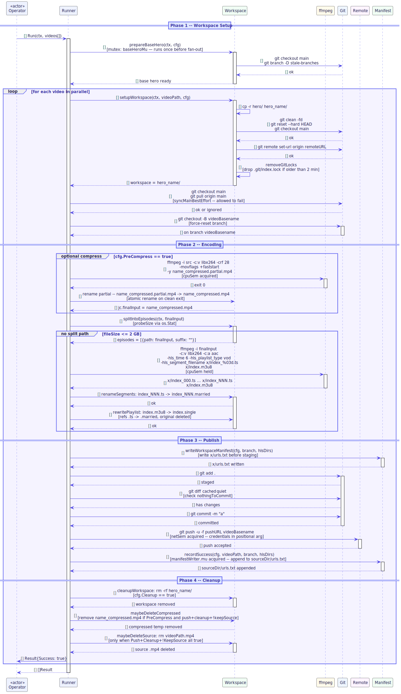

## Table of Contents

1. [Meta Information](#1-meta-information)
2. [Description & Use Case](#2-description--use-case)
   - [2.1 Business & UX Overview](#21-business--ux-overview)
   - [2.2 Technical System Logic](#22-technical-system-logic)
3. [Pre-conditions & Post-conditions](#3-pre-conditions--post-conditions)
4. [Stage Contracts](#4-stage-contracts)
   - [4.1 workspace](#41-workspace)
   - [4.2 branch](#42-branch)
   - [4.3 compress (optional)](#43-compress-optional)
   - [4.4 split (auto)](#44-split-auto)
   - [4.5 convert](#45-convert)
   - [4.6 rename](#46-rename)
   - [4.7 push](#47-push)
   - [4.8 cleanup](#48-cleanup)
5. [Controls & States](#5-controls--states)
6. [File System Layout](#6-file-system-layout)
7. [Technical Sequence Flow](#7-technical-sequence-flow)
8. [Invariants & Safety Rules](#8-invariants--safety-rules)
9. [Change History](#9-change-history)

---

## 1. Meta Information

| Field       | Value                       |
|-------------|-----------------------------|
| Flow ID     | FS-PIPELINE-01              |
| Subdomain   | HLS Conversion Pipeline     |
| Status      | Approved                    |
| Version     | 1.0.0                       |
| Created     | 2026-06-17                  |
| Author      | ichamrong                   |

---

## 2. Description & Use Case

### 2.1 Business & UX Overview

`ivideo-hls` is a Go CLI that batch-converts one or more `.mp4` files into HLS (HTTP Live Streaming) format and publishes each result to a dedicated git branch on a remote repository. Downstream players fetch segments directly from raw git hosting (e.g., GitHub raw URLs), eliminating the need for a video CDN.

The operator points the CLI at a directory of `.mp4` files. The tool processes every file — optionally in parallel — and emits a `urls.txt` manifest upon completion so downstream systems know where to find each published playlist.

Key operator benefits:

- No CDN required: HLS segments are served via raw git hosting.
- Parallel throughput: CPU-bound encoding and network-bound pushes run on independent semaphore pools.
- Safe defaults: source `.mp4` files are deleted only when all three conditions hold — push succeeded, cleanup is enabled, and `--keep-source` is absent.
- Incremental recovery: leftover workspaces from prior failed runs are detected and can be retried with a push-only path.

### 2.2 Technical System Logic

Each video travels through an ordered set of pipeline steps managed by `Runner.processOne`. In parallel mode, all videos fan out across an `errgroup`; each goroutine runs the full per-video step chain independently.

The pipeline steps in order are:

1. `stepSetupWorkspace` — clones or reuses a per-video git workspace.
2. `stepCheckoutBranch` — force-resets the workspace to a clean branch named after the video.
3. `stepPreCompress` — optional libx264 pre-pass to reduce source file size before HLS encoding.
4. `stepConvert` — runs `splitIntoEpisodes` followed by `convertToHLS` (or multiple `processEpisodePart` sub-jobs for large files).
5. `stepCommitAndPush` — writes workspace manifest, stages all files, commits, and force-pushes.

After all steps succeed, `recordSuccess` appends the public URL to the source directory `urls.txt` and `stepFinalize` cleans up the workspace and deletes the source `.mp4`.

---

## 3. Pre-conditions & Post-conditions

### Pre-conditions

- The source `.mp4` file exists and is readable (`os.Stat` passes).
- `ffmpeg` and `ffprobe` binaries are available on `$PATH` (or at configured paths in `deps`).
- The `hero/` base template directory exists in the script directory when running in parallel mode. If absent, each video workspace is initialized from scratch with `git init`.
- `cfg.RemoteURL` is set to a valid git remote. `cfg.EffectivePushURL()` resolves the push-credential form (credentials embedded in URL, never persisted to `git remote` config).

### Post-conditions

- One git branch per video (or per split part) exists on the remote, containing HLS segments (`.married`) and a renamed playlist (`.single`).
- A `urls.txt` entry is appended to the source directory listing the public playlist URL.
- A `urls.txt` entry is committed inside the workspace `x/` directory before the push, making each branch self-describing.
- The source `.mp4` is deleted when `Push`, `Cleanup`, and `!KeepSource` are all true.
- The workspace directory `hero_<name>/` is deleted when `Cleanup` is true.
- On any step failure the workspace is preserved on disk for operator inspection.

---

## 4. Stage Contracts

### 4.1 workspace

**Function:** `stepSetupWorkspace` → `setupWorkspace` + `removeGitLocks` + `configureRemoteOrigin`

**Purpose:** Produce a per-video git working tree ready to receive HLS output.

**Inputs:**
- `videoPath` — absolute path to source `.mp4`
- `cfg.ScriptDir` — parent directory for all workspaces
- `cfg.BaseHeroDir` — path to the `hero/` template (may not exist)
- `cfg.RemoteURL` — remote git URL

**Outputs:**
- `jc.workspace` — absolute path `<scriptDir>/hero_<sanitized>/`

**Behavior:**
1. Derive `sanitized` name: `basename(videoPath)` stripped of extension, non-`[a-zA-Z0-9_-]` characters replaced with `_`.
2. Workspace path: `<scriptDir>/hero_<sanitized>/`.
3. Guard: refuse if workspace path equals `cfg.BaseHeroDir` (would destroy the template).
4. If workspace already exists: configure remote and return it as-is (resume semantics).
5. If `hero/.git` exists: `cp -r hero/ hero_<sanitized>/`, then `git clean -fd`, `git reset --hard HEAD`, `git checkout main`, configure remote.
6. Otherwise: `git init -b main`, configure remote, write `.gitkeep` initial commit if `hero/` does not exist.
7. After returning from `setupWorkspace`: call `removeGitLocks(ws)` to remove any `.git/index.lock` older than 2 minutes (stale lock from a prior killed run).

**Semaphore:** None — I/O-bound copy overlaps with encoding in other jobs.

### 4.2 branch

**Function:** `stepCheckoutBranch` → `syncMainBestEffort` + `git checkout -B <branch>`

**Purpose:** Reset the workspace to a clean branch named after the video.

**Inputs:**
- `jc.workspace` — workspace path from stage 4.1
- `jc.branch` — `basename(videoPath)` without extension (no sanitization on branch name)

**Outputs:**
- Workspace HEAD points to branch `<videoBasename>`, clean working tree.

**Behavior:**
1. `syncMainBestEffort`: attempt `git checkout main` and `git pull origin main` — both allowed to fail (new workspace may have no tracking branch).
2. `git checkout -B <branch>` — force-create or reset the branch. This is the correctness guarantee; sync above is best-effort only.

**Semaphore:** None.

### 4.3 compress (optional)

**Function:** `stepPreCompress` → `compressVideo` (under `cpuSem`)

**Purpose:** Reduce source file size before HLS encoding using a single-pass libx264 transcode.

**Enabled when:** `cfg.PreCompress == true`

**Inputs:**
- `jc.videoPath` — original source `.mp4`

**Outputs:**
- `jc.finalInput` — path to `<name>_compressed.mp4` sibling of the source file
- Side-effect: `<name>_compressed.partial.mp4` written during encoding, renamed to final name on clean exit

**ffmpeg arguments:**
```
-i <input>
-c:v libx264 -preset medium -crf 28
-vf scale='min(1920,iw)':'min(1080,ih)':force_original_aspect_ratio=decrease
-c:a aac -b:a 128k
-movflags +faststart
-y <name>_compressed.partial.mp4
```

**Atomic write discipline:** ffmpeg writes to `<name>_compressed.partial.mp4`; on clean exit the file is renamed to `<name>_compressed.mp4`. A crash leaves the `.partial` file in place — visible to `doctor` and `resume-failed` commands.

**Semaphore:** `cpuSem` — one slot (compress is CPU-bound).

### 4.4 split (auto)

**Function:** `stepConvert` → `splitIntoEpisodes`

**Purpose:** When the input file exceeds 2 GB, split it into equal-duration stream-copy parts. Each part becomes an independent sub-job with its own workspace, branch, convert, and push.

**Threshold:** `2 × 1024 × 1024 × 1024` bytes (2 GiB), checked via `os.Stat`.

**Inputs:**
- `jc.finalInput` — path after optional compress

**Outputs (split path):**
- N temporary `.mp4` parts written alongside the source file: `<base>a.mp4`, `<base>b.mp4`, …
- Each part processed by `processEpisodePart` (its own workspace, branch, convert, commit, push).
- `errSplitHandled` sentinel returned to caller — signals that sub-jobs handled commit/push.

**Outputs (no-split path):**
- Single-element `[]episode` with `suffix == ""` — proceeds to stage 4.5 in the normal workspace.

**Part count:** `ceil(fileBytes / 2GiB)`

**Part duration:** `totalDuration / numParts` via `ffprobe`

**Suffix mapping:** index 0 → `"a"`, 1 → `"b"`, …, 25 → `"z"`, 26 → `"aa"`, 27 → `"ab"`, …

**ffmpeg split arguments:**
```
-ss <start_seconds> -i <input> -c copy -avoid_negative_ts make_zero [-t <dur_seconds>] -y <output>
```
The last part omits `-t` to capture any remaining frames from rounding drift.

**Semaphore:** `cpuSem` (the outer `stepConvert` call holds the slot across split detection and all part processing).

### 4.5 convert

**Function:** `convertToHLS` (under `cpuSem`)

**Purpose:** Encode the input into HLS segments and a playlist.

**Inputs:**
- Episode path (original or split part)
- `jc.workspace` — destination working tree

**Outputs:**
- `<workspace>/x/index_NNN.ts` — HLS segments (before rename)
- `<workspace>/x/index.m3u8` — HLS playlist (before rename)

**ffmpeg arguments (default quality/compression):**
```
-i <input>
-c:v libx264 -c:a aac
-b:v 2800k -maxrate 2800k -bufsize 5600k
-b:a 128k
-vf scale=-2:720
-preset medium -crf 23
-g 48 -sc_threshold 0
-profile:v high -level 4.0
-movflags +faststart
-hls_time 6 -hls_playlist_type vod
-hls_segment_filename <workspace>/x/index_%03d.ts
<workspace>/x/index.m3u8
```

Quality and compression flags (`cfg.Quality`, `cfg.Compression`) adjust preset, CRF, bitrate, and resolution. See `settingsFor()` in `ffmpeg.go`.

**Semaphore:** `cpuSem` (shared with compress).

### 4.6 rename

**Function:** `renameHLSOutputs` → `renameSegments` + `rewritePlaylist`

**Purpose:** Apply the downstream-required file extension rename so players can locate segments by their expected names.

**Transforms:**
- Every `index_NNN.ts` → `index_NNN.married` (OS rename).
- `index.m3u8` is read, all `.ts` references rewritten to `.married`, written as `index.single`, original `.m3u8` deleted.

**Invariant:** This rename is required by downstream player stacks. The extensions `.married` and `.single` are not configurable without a paired downstream update.

### 4.7 push

**Function:** `stepCommitAndPush` → `writeWorkspaceManifest` + `stageAndCommit` + `forcePush`

**Purpose:** Commit all HLS output and force-push the branch to the remote repository.

**Inputs:**
- `jc.workspace` — must contain `x/index.single` and `x/index_*.married`
- `jc.branch` — target branch name
- `cfg.EffectivePushURL()` — push URL with embedded credentials

**Behavior:**
1. `writeWorkspaceManifest`: write `urls.txt` inside each `x/` directory before staging so the URL is committed alongside segments.
2. `git add .` — stage everything; warnings are logged but non-fatal.
3. Check `git diff --cached --quiet` — if staging area is clean, skip commit (idempotent for retry path).
4. `git commit -m "a"` — minimal commit message (content is the payload, not the message).
5. `git push -u -f <pushURL> <branch>` — credentials passed as positional argument; never stored in remote config or reflog.

**Semaphore:** `netSem` — one slot per push (network-bound).

**Push skipped:** when `cfg.Push == false`, a warning is emitted with the manual push command and the step returns success.

### 4.8 cleanup

**Function:** `stepFinalize` → `cleanupWorkspace` + `maybeDeleteCompressed` + `maybeDeleteSource`

**Purpose:** Remove transient artifacts after a fully successful job.

**Workspace removal:** `os.RemoveAll(jc.workspace)` when `cfg.Cleanup == true`. The base `hero/` directory is never deleted (guard in `cleanupWorkspace`).

**Compressed file removal:** `<name>_compressed.mp4` deleted when `PreCompress` is true, the compressed file differs from the source path, and `shouldKeepSource()` returns false.

**Source `.mp4` deletion:** deleted when all three hold:
- `cfg.Push == true`
- `cfg.Cleanup == true`
- `cfg.KeepSource == false`

Any of these conditions being false keeps the source file with a logged reason. Source deletion is the only irreversible action in the pipeline; the conditions are OR-checked to fail safe.

---

## 5. Controls & States

| Control               | Type                        | Capacity              | Guards                                         |
|-----------------------|-----------------------------|-----------------------|------------------------------------------------|
| `cpuSem`              | `semaphore.Weighted`        | `cfg.MaxParallel`     | compress (`stepPreCompress`) + convert (`stepConvert`) |
| `netSem`              | `semaphore.Weighted`        | `cfg.MaxParallel × 2` | git push (`forcePush`)                         |
| `baseHeroMu`          | `sync.Mutex`                | 1 (exclusive)         | `prepareBaseHero` — runs once before fan-out in parallel mode |
| `manifestWriter.mu`   | `sync.Mutex` (inside `manifestWriter`) | 1 (exclusive) | `appendLine` — guards `urls.txt` appends across parallel jobs |
| `Runner.mu`           | `sync.Mutex`                | 1 (exclusive)         | `addResult` — guards `results` slice appends  |

### Semaphore nil behavior

When `cfg.ParallelMode == false` or `cfg.MaxParallel <= 1`, `cpuSem` and `netSem` are both `nil`. `gateTracked` detects a nil semaphore and runs the function directly (serial mode, no contention).

### Live slot counters

`Runner.cpuInUse` and `Runner.netInUse` are `atomic.Int32` counters incremented after `sem.Acquire` succeeds and decremented in the deferred release. The TUI reads these via `Runner.Usage()` to display a live `CPU 3/3 · NET 1/6` gauge.

### State transitions per job

```
queued → workspace_setup → branch_checkout → [compress] → convert → [split_parts...] → commit → push → done
                                                                                                   ↓ (any step)
                                                                                               failed (workspace preserved)
```

---

## 6. File System Layout

### Script directory (workspace tree)

```
<scriptDir>/
  hero/                       ← sacred base template (cp source for new workspaces)
    .git/
    .gitkeep
  hero_<sanitized_name>/      ← per-video workspace (deleted on success when Cleanup=true)
    .git/
      index.lock              ← removed if >2 min old at workspace setup
    x/
      index_000.married       ← HLS segment (renamed from .ts)
      index_001.married
      …
      index.single            ← HLS playlist (renamed from .m3u8, refs rewritten)
      urls.txt                ← written before commit; committed to branch
```

### Source directory (output tree)

```
<sourceDir>/
  lesson-01.mp4               ← deleted on full success (Push+Cleanup+!KeepSource)
  lesson-01_compressed.mp4    ← written by compress stage (if PreCompress=true)
  lesson-01_compressed.partial.mp4  ← transient; present only during active compress
  urls.txt                    ← one line appended per successful job
```

### Split video workspace tree

When a file is split, each part gets its own workspace and branch:

```
<scriptDir>/
  hero_lesson01a/             ← workspace for part a
    .git/
    x/
      index_000.married
      …
      index.single
      urls.txt
  hero_lesson01b/             ← workspace for part b
    .git/
    x/
      …
```

---

## 7. Technical Sequence Flow



> Source: [`assets/fs_pipeline_01_seq_hls_convert.puml`](assets/fs_pipeline_01_seq_hls_convert.puml)

The diagram covers four phases:

- **Phase 1 — Workspace Setup:** `prepareBaseHero` (mutex), `copyHero`, `removeGitLocks`, `configureRemoteOrigin`, `checkout -B`.
- **Phase 2 — Encoding:** optional compress (atomic `.partial` rename), `splitIntoEpisodes` check, `convertToHLS`, `renameHLSOutputs`.
- **Phase 3 — Publish:** `writeWorkspaceManifest`, `git add/commit`, `git push -u -f`, `recordSuccess` appending to source `urls.txt`.
- **Phase 4 — Cleanup:** `cleanupWorkspace`, `maybeDeleteCompressed`, `maybeDeleteSource`.

---

## 8. Invariants & Safety Rules

| # | Invariant |
|---|-----------|
| 1 | **Branch name = basename(video) minus extension.** No character sanitization is applied to branch names. Workspace directory names use a sanitized form (`[^a-zA-Z0-9_-]` → `_`), but the git branch carries the raw basename. |
| 2 | **`.ts` → `.married` rename is invariant.** Downstream players expect `.married` segment extensions. Changing this extension requires a paired update in all consumers. |
| 3 | **`.m3u8` → `.single` rename is invariant.** Same constraint as above. Playlist references inside `index.single` are rewritten to `.married` before the original `.m3u8` is deleted. |
| 4 | **Force-push is invariant.** Each branch is owned by exactly one video. Re-running the pipeline for the same video always force-pushes over the prior branch state. |
| 5 | **Credentials are never written to git remote config.** The push URL (with embedded credentials from `cfg.EffectivePushURL()`) is passed as the positional `<repository>` argument to `git push` — it does not appear in `git remote -v` or the reflog. |
| 6 | **Compress writes are atomic.** ffmpeg targets `<name>_compressed.partial.mp4`; `os.Rename` promotes it to `<name>_compressed.mp4` only on clean exit. The presence of a `.partial` sibling signals an interrupted compress. |
| 7 | **Source deletion fails safe.** The source `.mp4` is deleted only when `Push`, `Cleanup`, and `!KeepSource` are all simultaneously true. Any single flag being false preserves the file. |
| 8 | **Base hero directory is never deleted or overwritten.** `cleanupWorkspace` guards against `filepath.Base(workspace) == "hero"`. `setupWorkspace` refuses to create `hero_<name>` at the same path as `cfg.BaseHeroDir`. |
| 9 | **`errSplitHandled` is a clean exit code.** When returned by `stepConvert`, `processOne` treats it as full success, not an error. The per-part sub-jobs have already committed, pushed, and written manifests before the sentinel is returned. |
| 10 | **`nothingToCommit` prevents double-commit.** Before `git commit`, `git diff --cached --quiet` is checked. A clean staging area skips the commit silently, making the push step idempotent for retry scenarios. |

---

## 9. Change History

| Version | Date       | Author     | Notes          |
|---------|------------|------------|----------------|
| 1.0.0   | 2026-06-17 | ichamrong  | Initial draft  |
