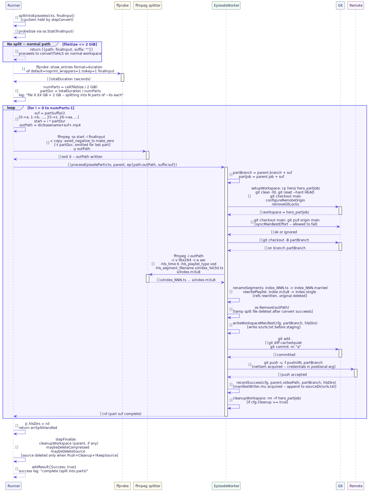

## Table of Contents

1. [Meta Information](#1-meta-information)
2. [Description & Use Case](#2-description--use-case)
   - [2.1 Business & UX Overview](#21-business--ux-overview)
   - [2.2 Technical System Logic](#22-technical-system-logic)
3. [Pre-conditions & Post-conditions](#3-pre-conditions--post-conditions)
4. [Stage Contracts](#4-stage-contracts)
   - [4.1 Detection](#41-detection)
   - [4.2 Duration Probe](#42-duration-probe)
   - [4.3 Part Calculation](#43-part-calculation)
   - [4.4 ffmpeg Stream-Copy Split](#44-ffmpeg-stream-copy-split)
   - [4.5 Per-Part Sub-Job](#45-per-part-sub-job)
   - [4.6 Temp File Cleanup](#46-temp-file-cleanup)
   - [4.7 Sentinel Return](#47-sentinel-return)
5. [Controls & States](#5-controls--states)
6. [File System Layout](#6-file-system-layout)
7. [Technical Sequence Flow](#7-technical-sequence-flow)
8. [Invariants & Safety Rules](#8-invariants--safety-rules)
9. [Change History](#9-change-history)

---

## 1. Meta Information

| Field       | Value                       |
|-------------|-----------------------------|
| Flow ID     | FS-PIPELINE-02              |
| Subdomain   | Large-file Auto-split       |
| Status      | Approved                    |
| Version     | 1.0.0                       |
| Created     | 2026-06-17                  |
| Author      | ichamrong                   |

---

## 2. Description & Use Case

### 2.1 Business & UX Overview

HLS encoding of very large `.mp4` files (recordings exceeding 2 GB) presents two practical problems: a single workspace branch becomes unwieldy for downstream git hosting, and individual segment counts can exhaust platform limits. The auto-split feature transparently resolves this by dividing a large file into equal-duration stream-copy parts before HLS encoding, then publishing each part to its own branch (`<basename>a`, `<basename>b`, …).

From the operator's perspective the workflow is identical — they point the CLI at a directory of `.mp4` files and receive `urls.txt` entries per part. No manual splitting is required.

### 2.2 Technical System Logic

`splitIntoEpisodes` is called at the start of `stepConvert`. It checks the file size using `os.Stat`. Files at or below the 2 GiB threshold return a single no-op episode and the pipeline continues on the normal path. Files above the threshold trigger:

1. A `ffprobe` call to get total duration.
2. Part count and per-part duration calculation.
3. Sequential `ffmpeg -c copy` calls to carve out each part into a temp `.mp4` file alongside the source.
4. A `processEpisodePart` call for each part — this runs the full workspace-setup → branch-checkout → convert → commit → push cycle as an independent sub-job.
5. Each temp split file is deleted after its part's `convertToHLS` succeeds.
6. After all parts complete, `errSplitHandled` is returned — the caller (`processOne`) treats this as clean success and skips the normal commit/push path (which was already handled per-part).

---

## 3. Pre-conditions & Post-conditions

### Pre-conditions

- `jc.finalInput` exists and is readable (guaranteed by prior pipeline stages).
- `ffprobe` binary is available at `deps.FFprobePath()`.
- `ffmpeg` binary is available at `deps.FFmpegPath()`.
- The directory containing `jc.finalInput` is writable (temp part files are written alongside the source).
- `cpuSem` has been acquired by the caller (`stepConvert` runs inside `runCPU`).

### Post-conditions

- N git branches exist on the remote, one per part: `<basename>a`, `<basename>b`, …
- N entries are appended to the source directory `urls.txt`, one per part.
- All temp split files (`<basename>a.mp4`, `<basename>b.mp4`, …) are deleted.
- `errSplitHandled` sentinel is returned to `processOne`.
- The original source file is not deleted by the split stage — source deletion is handled by `stepFinalize` in the parent job.

---

## 4. Stage Contracts

### 4.1 Detection

**Function:** `splitIntoEpisodes` → `probeSize`

**Threshold:** `splitThresholdBytes = 2 × 1024 × 1024 × 1024` (2 GiB)

**Detection mechanism:** `os.Stat(videoPath).Size()`. No ffprobe is called at this stage — size is a cheap syscall.

**Result:**
- `fileSize <= threshold` → return `[]episode{{path: videoPath, suffix: ""}}`. Normal path, no split.
- `fileSize > threshold` → proceed to duration probe.

### 4.2 Duration Probe

**Function:** `probeDuration(ctx, videoPath)`

**Purpose:** Obtain total video duration so equal-duration parts can be computed.

**Tool:** `ffprobe -v error -show_entries format=duration -of default=noprint_wrappers=1:nokey=1 <input>`

**Failure handling:** If `probeDuration` returns `<= 0` (ffprobe failure or zero-duration), `splitIntoEpisodes` returns an error: `"could not probe duration of <basename>"`. The parent job fails; no temp files are written.

### 4.3 Part Calculation

**Purpose:** Determine how many parts to cut and how long each part should be.

**Formula:**
```
size     = os.Stat(videoPath).Size()           // bytes
numParts = ceil(size / splitThresholdBytes)    // integer ceiling division
partDur  = totalDuration / numParts            // time.Duration arithmetic
```

**Suffix mapping:**

| Part index | Suffix |
|-----------|--------|
| 0         | `a`    |
| 1         | `b`    |
| …         | …      |
| 25        | `z`    |
| 26        | `aa`   |
| 27        | `ab`   |
| …         | …      |

Implementation in `partSuffix(i int) string`:
- `i < 26`: `string(rune('a' + i))`
- `i >= 26`: `string(rune('a' + i/26 - 1)) + string(rune('a' + i%26))`

A log line is emitted before cutting begins:
```
file X.XX GB > 2 GB — splitting into N part(s) of ~Xs each
```

### 4.4 ffmpeg Stream-Copy Split

**Function:** `splitArgs` → `ffmpeg` invocation per part

**Purpose:** Cut one time-bounded segment from the source file without re-encoding.

**Arguments (all parts except last):**
```
-ss <start_seconds> -i <input> -c copy -avoid_negative_ts make_zero -t <dur_seconds> -y <output>
```

**Arguments (last part — omits `-t`):**
```
-ss <start_seconds> -i <input> -c copy -avoid_negative_ts make_zero -y <output>
```

The last part intentionally omits `-t` to capture any remaining frames that rounding of `partDur` would otherwise miss (avoids a 1-frame gap at the end of the final part).

**Output path:** `<dir>/<basename><suffix>.mp4` — written alongside the source file.

**Failure handling:** If `ffmpeg` exits non-zero, the partial output file is deleted (`os.Remove(outPath)`) and `splitIntoEpisodes` returns an error immediately. Parts already cut are left on disk for operator inspection.

### 4.5 Per-Part Sub-Job

**Function:** `processEpisodePart(ctx, parent *jobContext, ep episode)`

**Purpose:** Run the full pipeline for one split part: workspace setup, branch checkout, HLS conversion, manifest write, commit, push, and per-part cleanup.

**Part identifiers:**
- `partBranch = parent.branch + ep.suffix` (e.g., `lesson-01a`)
- `partJob = parent.job + ep.suffix` (e.g., `lesson-01a`, used in log lines)

**Workspace:** A new `hero_<sanitized_partJob>/` workspace is set up via `setupWorkspace` — identical to the normal workspace stage in FS-PIPELINE-01, section 4.1.

**Steps executed inside `processEpisodePart`:**

| Step | Operation |
|------|-----------|
| workspace | `setupWorkspace`, `removeGitLocks`, `configureRemoteOrigin` |
| branch | `syncMainBestEffort`, `git checkout -B partBranch` |
| convert | `convertToHLS(ep.path, ws, cfg, ...)` → `x/index_NNN.ts` + `x/index.m3u8` |
| rename | `renameHLSOutputs` → `.ts` → `.married`, `.m3u8` → `.single` |
| temp cleanup | `os.Remove(ep.path)` — delete the split temp file after convert succeeds |
| manifest (workspace) | `writeWorkspaceManifest(cfg, partBranch, hlsDirs, ...)` → `x/urls.txt` |
| commit | `stageAndCommit` → `git add . && git commit -m "a"` |
| push | `forcePush` → `git push -u -f pushURL partBranch` (under `netSem`) |
| manifest (source) | `recordSuccess(cfg, parent.videoPath, partBranch, hlsDirs, ...)` → append to `sourceDir/urls.txt` |
| workspace cleanup | `cleanupWorkspace(ws, ...)` when `cfg.Cleanup == true` |

**Failure:** If any step fails, `processEpisodePart` returns the error. `stepConvert` propagates it to `processOne`, which calls `failJob` and preserves the workspace.

### 4.6 Temp File Cleanup

**Timing:** Each temp split file (`<base><suffix>.mp4`) is deleted immediately after `convertToHLS` succeeds for that part — before the commit/push steps run.

**On convert failure:** `os.Remove(ep.path)` is also called in the error path to avoid leaving large temp files on disk, then the error is returned.

**Original source file:** Not deleted by the split stage. The parent `stepFinalize` handles source deletion according to the normal rules (Push + Cleanup + !KeepSource).

### 4.7 Sentinel Return

**Sentinel:** `errSplitHandled = errors.New("split: per-part jobs complete")`

**Purpose:** Signal to `processOne` that the split path ran to completion — all parts were committed, pushed, and recorded — so the normal `stepCommitAndPush` and `recordSuccess` calls in `processOne` must be skipped.

**Handling in `processOne`:**
```go
if errors.Is(err, errSplitHandled) {
    r.stepFinalize(jc)
    success(...)
    r.addResult(Result{Video: videoPath, Success: true})
    return
}
```

`jc.hlsDirs` is set to `nil` before returning `errSplitHandled`, so `stepFinalize` only performs workspace and source cleanup — no manifest append (already done per-part).

---

## 5. Controls & States

| Control    | Type                    | Scope                                                                |
|------------|-------------------------|----------------------------------------------------------------------|
| `cpuSem`   | `semaphore.Weighted`    | Held by `stepConvert` across the entire split operation — detection, ffmpeg cuts, and all `processEpisodePart` calls run under this one slot. |
| `netSem`   | `semaphore.Weighted`    | Acquired per push inside each `processEpisodePart` (same as normal path). |
| `manifestWriter.mu` | `sync.Mutex` | Guards `appendLine` during `recordSuccess` inside each part — correct even when multiple parent jobs are splitting in parallel. |

### State transitions for a split job

```
stepConvert entered
  probeSize > 2 GB
    probeDuration
    compute numParts, partDur
    for each part:
      ffmpeg stream-copy cut → part_N.mp4
      processEpisodePart(part_N):
        workspace setup
        branch checkout
        convertToHLS
        rm part_N.mp4          ← temp file gone
        writeWorkspaceManifest
        git add/commit
        git push
        recordSuccess
        cleanupWorkspace
    return errSplitHandled
processOne receives errSplitHandled
  stepFinalize (workspace + source cleanup)
  addResult{Success: true}
```

---

## 6. File System Layout

### During split (transient)

```
<sourceDir>/
  lesson-01.mp4               ← original (not deleted by split stage)
  lesson-01a.mp4              ← temp part a (deleted after part a converts)
  lesson-01b.mp4              ← temp part b (deleted after part b converts)
  …
  urls.txt                    ← one line appended per part after its push
```

### After split completes (at cleanup)

```
<scriptDir>/
  hero_lesson_01a/            ← workspace for part a (removed if Cleanup=true)
    .git/
    x/
      index_000.married
      …
      index.single
      urls.txt
  hero_lesson_01b/            ← workspace for part b (removed if Cleanup=true)
    .git/
    x/
      index_000.married
      …
      index.single
      urls.txt

<sourceDir>/
  lesson-01.mp4               ← deleted by stepFinalize if Push+Cleanup+!KeepSource
  urls.txt
    https://.../lesson-01a/x/index.single
    https://.../lesson-01b/x/index.single
```

---

## 7. Technical Sequence Flow



> Source: [`assets/fs_pipeline_02_seq_split.puml`](assets/fs_pipeline_02_seq_split.puml)

The diagram covers:

- The `probeSize` decision gate showing the no-split and split divergence.
- `probeDuration` and part count calculation.
- The loop over N parts: `ffmpeg -c copy` cut, `processEpisodePart` (workspace + convert + commit + push), temp file deletion.
- `errSplitHandled` return and parent job finalization.

---

## 8. Invariants & Safety Rules

| # | Invariant |
|---|-----------|
| 1 | **Threshold is a hard binary check.** A file is either below 2 GiB (single episode, no split) or above (split). There is no partial or configurable threshold. |
| 2 | **Parts are stream-copied, not re-encoded.** `-c copy` preserves original quality and is fast. Codec parameters are unchanged. |
| 3 | **Last part always omits `-t`.** Rounding of `partDur` can cause the last computed segment to end 1–2 frames early. Omitting `-t` on the last part ensures all remaining frames are captured. |
| 4 | **Temp files are deleted per-part, not in batch.** Each `<base><suffix>.mp4` is removed immediately after its `convertToHLS` succeeds. This bounds peak disk usage to at most `original_size + one_part_size` at any given moment. |
| 5 | **`errSplitHandled` bypasses the parent commit/push.** The parent `processOne` must not commit or push after a split — doing so would push the workspace from stage 4.2 (which may be empty or stale). The sentinel enforces this contract. |
| 6 | **Branch names carry the part suffix without sanitization.** `partBranch = parent.branch + suffix`. The suffix is always ASCII lowercase letters, so no additional escaping is needed. |
| 7 | **A split failure on any part fails the whole job.** `processEpisodePart` propagates errors immediately. Parts already pushed are not rolled back — they remain on the remote. The operator can retry the full file or manually push remaining parts. |
| 8 | **`cpuSem` is held across all parts.** The split loop does not release and re-acquire `cpuSem` between parts. This is intentional: the slot represents the encoding work for this video file as a whole, preventing other jobs from preempting mid-split when CPU headroom is tight. |

---

## 9. Change History

| Version | Date       | Author     | Notes          |
|---------|------------|------------|----------------|
| 1.0.0   | 2026-06-17 | ichamrong  | Initial draft  |
