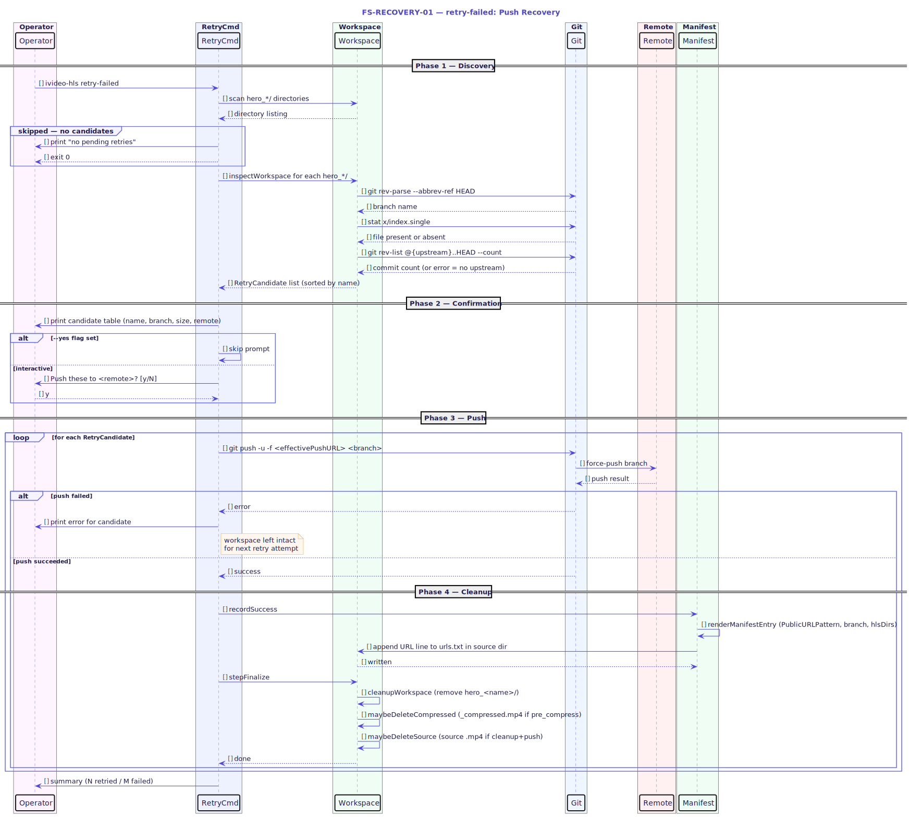

# FS-RECOVERY-01 — Retry Failed (Push Recovery)

## Table of Contents

1. [Meta Information](#1-meta-information)
2. [Description & Use Case](#2-description--use-case)
3. [Pre-conditions & Post-conditions](#3-pre-conditions--post-conditions)
4. [Qualification Contract](#4-qualification-contract)
5. [Recovery Steps](#5-recovery-steps)
6. [Technical Sequence Flow](#6-technical-sequence-flow)
7. [Invariants](#7-invariants)
8. [Change History](#8-change-history)

---

## 1. Meta Information

| Field       | Value                        |
|-------------|------------------------------|
| Flow ID     | FS-RECOVERY-01               |
| Subdomain   | Push Recovery                |
| Status      | Approved                     |
| Version     | 1.0.0                        |
| Created     | 2026-06-17                   |
| Source file | `cmd/ivideo-hls/retry.go`    |
| Core logic  | `internal/pipeline/retry.go` |
| Diagram     | `assets/fs_recovery_01_seq_retry.puml` |

---

## 2. Description & Use Case

`retry-failed` is a targeted recovery command for the most common partial failure mode: encoding completed successfully and the git commit is in place, but the push to the remote never landed (network drop, auth error, rate limit, SSH timeout).

Without this command, the operator would have to re-encode the video from scratch the next time they run `ivideo-hls`. That wastes CPU time and ffmpeg wall-clock time — often hours per video. `retry-failed` detects workspaces that are in this exact state and force-pushes the already-committed HLS tree directly, bypassing all encoding stages entirely.

**Primary trigger:** git push step exited non-zero after a successful `git commit`.

**Workspace preservation guarantee:** when `forcePush` fails, `ivideo-hls` does not delete the workspace. The `hero_<name>/` directory survives, making it available to this command on the next invocation.

---

## 3. Pre-conditions & Post-conditions

### Pre-conditions

- The operator is in the working directory that contains the `hero_<name>/` workspace(s).
- At least one `hero_<name>/` directory satisfies the qualification contract (§4).
- The remote URL in the loaded config is reachable (network, auth).
- The operator has push access to the remote branch.

### Post-conditions (success)

- The HLS tree is visible on the remote under the branch named after the video.
- `urls.txt` in the source directory contains a new line with the public playback URL.
- The `hero_<name>/` workspace is deleted (if `cleanup=true` in config).
- The source `.mp4` is deleted (if `cleanup=true` and `push=true` in config).

### Post-conditions (failure)

- The workspace is left intact for the next retry attempt.
- No manifest entry is written.
- Exit code is `1`; the failing workspace name(s) are printed to stderr.

---

## 4. Qualification Contract

A `hero_<name>/` directory qualifies as a retry candidate if and only if **all four** conditions hold:

| # | Condition | Implementation |
|---|-----------|----------------|
| 1 | Directory name matches `hero_*` (not exactly `hero`) | `isHeroWorkspace()` |
| 2 | Contains a `.git/` subdirectory (is a git repo) | `hasGit()` |
| 3 | `x/index.single` exists inside the workspace (encoding finished) | `hasFinishedOutput()` |
| 4 | Has at least one unpushed commit (or no upstream, treated as unpushed) | `hasUnpushedCommits()` |

If `x/index.single` is absent, the workspace belongs to `resume-failed` (FS-RECOVERY-02), not this command.

`hasUnpushedCommits()` uses `git rev-list @{upstream}..HEAD --count`. If the upstream reference does not exist (brand-new branch never pushed), the rev-list command errors and the function returns `true` — meaning a first-push workspace always qualifies.

---

## 5. Recovery Steps

### 5.1 Discovery

`FindRetryCandidates` scans the working directory for all entries whose name starts with `hero_`. Each entry is passed through `inspectWorkspace`, which runs the four qualification checks (§4). The result set is sorted alphabetically by name for stable, predictable output.

If zero candidates are found, the command prints a success message and exits 0. No user interaction occurs.

### 5.2 Confirmation

When at least one candidate is found, the CLI displays a table listing:
- Sanitized name (the `hero_` suffix)
- Branch name (from `git rev-parse --abbrev-ref HEAD`)
- Total output size (sum of all files under `x/`)
- Remote URL from config

The operator is prompted `Push these to <remote>? [y/N]`. Passing `--yes` / `-y` skips the prompt. Entering anything other than `y` or `yes` cancels and exits 0.

### 5.3 Push (per candidate)

For each qualifying candidate, `RetryOne` is invoked:

1. **Construct jobContext** — sets `job`, `branch`, `workspace`, and a best-guess `videoPath` from `guessSourcePath(cfg.SourceDir, name)`.
2. **Force-push** — calls `forcePush`, which runs:
   ```
   git push -u -f <effectivePushURL> <branch>
   ```
   The credential-bearing URL is passed as the positional `<repository>` argument so it never lands in `git remote -v` or the reflog.
3. **Record manifest** — calls `recordSuccess`, which appends the rendered public URL to `urls.txt` in the source directory (one line per HLS dir, one per episode for split workspaces).
4. **Finalize** — calls `stepFinalize`, which:
   - Removes the workspace directory (if `cleanup=true`).
   - Removes the `_compressed.mp4` sibling (if `pre_compress=true` and `cleanup=true` and `push=true`).
   - Removes the source `.mp4` (if `cleanup=true` and `push=true` and not `--keep-source`).

### 5.4 Summary

After all candidates are processed, a summary is printed:
- `✔ retried N workspace(s)` on full success (exit 0).
- `✗ N of M retries failed: <names>` when any push failed (exit 1).

Failed workspaces are left intact and will be picked up on the next `retry-failed` invocation.

---

## 6. Technical Sequence Flow



> Source: [`assets/fs_recovery_01_seq_retry.puml`](assets/fs_recovery_01_seq_retry.puml)

Key participants and their roles:

| Participant | Role |
|-------------|------|
| Operator    | Initiates the command; confirms the prompt |
| RetryCmd    | CLI entry point (`cmd/ivideo-hls/retry.go`) |
| Workspace   | The `hero_<name>/` git directory on disk |
| Git         | Local git operations (branch detection, unpushed check) |
| Remote      | The configured git remote (GitHub, GitLab, etc.) |
| Manifest    | `urls.txt` writer (`manifest.go`) |

---

## 7. Invariants

| # | Invariant |
|---|-----------|
| I-1 | `retry-failed` never invokes ffmpeg or ffprobe. No re-encoding occurs. |
| I-2 | A workspace is only deleted on push success. A failed push leaves the workspace intact for the next retry. |
| I-3 | `x/index.single` must exist before this command touches the workspace. Workspaces without it are silently skipped (they belong to FS-RECOVERY-02). |
| I-4 | The manifest line is written only after a confirmed successful push. |
| I-5 | The force-push URL is never stored in the git remote config or logged in plain text; credentials are injected inline as the positional `<repository>` argument. |
| I-6 | Source deletion applies the same guard logic as normal pipeline runs: `shouldKeepSource()` requires both `cleanup=true` and `push=true`. |

---

## 8. Change History

| Version | Date       | Author     | Summary                |
|---------|------------|------------|------------------------|
| 1.0.0   | 2026-06-17 | ichamrong  | Initial approved spec  |
