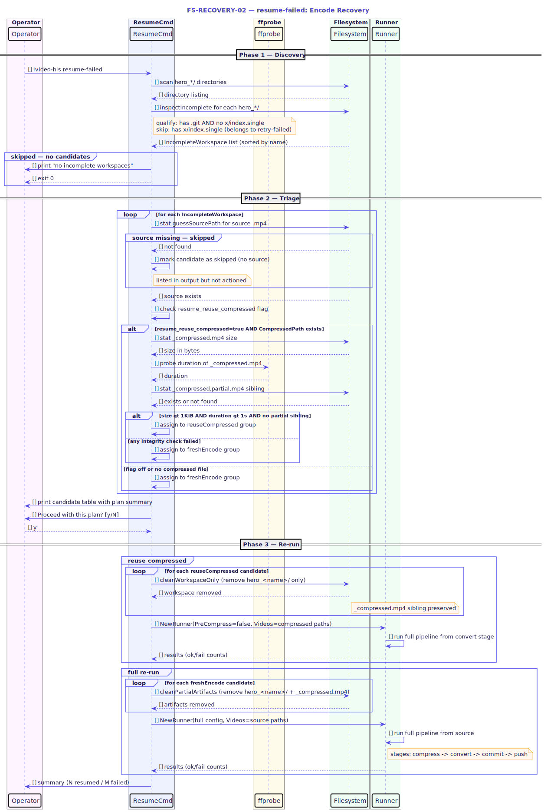

# FS-RECOVERY-02 — Resume Failed (Encode Recovery)

## Table of Contents

1. [Meta Information](#1-meta-information)
2. [Description & Use Case](#2-description--use-case)
3. [Pre-conditions & Post-conditions](#3-pre-conditions--post-conditions)
4. [Qualification Contract](#4-qualification-contract)
5. [Recovery Steps](#5-recovery-steps)
6. [Reuse-Compressed Policy](#6-reuse-compressed-policy)
7. [Technical Sequence Flow](#7-technical-sequence-flow)
8. [Invariants](#8-invariants)
9. [Change History](#9-change-history)

---

## 1. Meta Information

| Field       | Value                         |
|-------------|-------------------------------|
| Flow ID     | FS-RECOVERY-02                |
| Subdomain   | Encode Recovery               |
| Status      | Approved                      |
| Version     | 1.0.0                         |
| Created     | 2026-06-17                    |
| Source file | `cmd/ivideo-hls/resume.go`    |
| Core logic  | `internal/pipeline/retry.go`  |
| Diagram     | `assets/fs_recovery_02_seq_resume.puml` |

---

## 2. Description & Use Case

`resume-failed` handles the harder recovery case: ffmpeg (or an earlier pipeline stage) was killed before it produced a complete HLS playlist. The workspace exists but `x/index.single` is absent, which means the output is unusable and a full pipeline re-run is required.

Unlike `retry-failed`, this command cannot simply push existing work. It must:
1. Remove the partial workspace (and, by default, any partial compressed sibling).
2. Re-run the full pipeline from the source `.mp4`.

An opt-in optimization (`resume_reuse_compressed`) allows skipping the compress stage when a trustworthy `_compressed.mp4` sibling already exists — saving significant CPU time when only the conversion stage was killed.

**Primary trigger:** ffmpeg was killed mid-encode, or any pipeline stage before `git commit` failed.

**Complement to retry-failed:** workspaces with `x/index.single` present are owned by `retry-failed` (FS-RECOVERY-01). `resume-failed` explicitly skips those.

---

## 3. Pre-conditions & Post-conditions

### Pre-conditions

- The operator is in the working directory that contains `hero_<name>/` workspace(s).
- At least one `hero_<name>/` directory satisfies the qualification contract (§4).
- For each candidate to be actioned, the source `.mp4` must exist in the configured source directory.
- The remote URL is configured and reachable.

### Post-conditions (success)

- The partial `hero_<name>/` workspace is deleted before the re-run begins.
- The source `.mp4` is re-processed through the full pipeline.
- On pipeline success, the HLS tree is pushed and a manifest entry is written.
- The workspace and source file are cleaned up according to normal config (`cleanup`, `push`, `keep_source`).

### Post-conditions (skipped — source missing)

- The workspace is listed in the output with an error annotation.
- No action is taken for that candidate.
- Other candidates with a present source are still processed.

### Post-conditions (failure)

- Exit code `1`; failed workspace names are printed.
- The workspace for a failed re-run is left intact by the normal pipeline failure path for future inspection.

---

## 4. Qualification Contract

A `hero_<name>/` directory qualifies as an incomplete (resume) candidate if and only if **all three** conditions hold and **one exclusion** does not apply:

| # | Condition | Implementation |
|---|-----------|----------------|
| 1 | Name matches `hero_*` (not exactly `hero`) | `isHeroWorkspace()` |
| 2 | Contains a `.git/` subdirectory | `hasGit()` |
| 3 | `x/index.single` is ABSENT (encoding did not finish) | `!hasFinishedOutput()` |
| — | EXCLUDED if `x/index.single` is present (belongs to `retry-failed`) | `FindIncompleteWorkspaces` guard |

Workspaces without `.git/` are skipped entirely — they are not ivideo-hls workspaces.

After qualification, each candidate is further classified by the pipeline stage it stopped at:

| Stage constant      | Signal |
|---------------------|--------|
| `IncompleteCompress` | A `_compressed.partial.mp4` exists (compress was killed) |
| `IncompleteConvert`  | `.ts` segment files present, no `.m3u8` playlist yet |
| `IncompleteRename`   | `.m3u8` playlist present but `index.single` rename never ran |
| `IncompleteUnknown`  | No segments, no partial compressed file |

This classification is display-only. The recovery action is the same in all cases: delete and re-run.

---

## 5. Recovery Steps

### 5.1 Discovery

`FindIncompleteWorkspaces` scans the working directory for `hero_*` entries. Each is checked against the qualification contract. The result list is sorted alphabetically.

### 5.2 Source Check

Each candidate is checked for `SourceExists`. The source path is guessed from the name using `guessSourcePath(cfg.SourceDir, name)`, which probes common video extensions (`.mp4`, `.mov`, etc.) before defaulting to `<name>.mp4`.

Candidates whose source is missing are included in the display output with an error annotation but are excluded from the action set (`selectResumable`). The command continues with the remaining candidates.

If zero candidates have a present source, an error is printed and the command exits 0 without user confirmation.

### 5.3 Plan Construction

`planResume` splits the resumable candidates into two groups based on the reuse-compressed policy (§6):

- **reuseCompressed** — will skip the compress stage; use the existing `_compressed.mp4` as the pipeline input.
- **freshEncode** — will delete both the workspace and the `_compressed.mp4` sibling (if any) and re-run from source.

### 5.4 Confirmation

The CLI displays the full candidate list (including skipped-source entries) alongside the derived plan summary. The operator is prompted `Proceed with this plan? [y/N]`. Passing `--yes` / `-y` bypasses the prompt.

### 5.5 Re-run

Two passes run in sequence:

**Pass 1 — Reuse Compressed** (if `plan.reuseCompressed` is non-empty):
1. For each candidate: `cleanWorkspaceOnly` removes only the `hero_<name>/` directory; the `_compressed.mp4` sibling is preserved.
2. A new `Runner` is constructed with `PreCompress=false` and `Videos` set to the compressed file paths.
3. The runner executes the full pipeline from the compress stage onward (convert → commit → push).

**Pass 2 — Fresh Encode** (if `plan.freshEncode` is non-empty):
1. For each candidate: `cleanPartialArtifacts` removes the `hero_<name>/` directory AND the `_compressed.mp4` sibling (if present).
2. A new `Runner` is constructed with the original config and `Videos` set to the source `.mp4` paths.
3. The runner executes the full pipeline from source (pre-compress → convert → commit → push).

### 5.6 Summary

After both passes complete, a combined count is reported:
- `✔ resumed N workspace(s)` on full success (exit 0).
- `✗ N ok · M failed` when any re-run failed (exit 1).

---

## 6. Reuse-Compressed Policy

When `resume_reuse_compressed = true` is set in the application config, `resume-failed` can skip the compress stage for a candidate if its `_compressed.mp4` sibling passes an integrity check.

### 6.1 Eligibility Table

All four conditions must be `true` for the compressed file to be reused:

| # | Condition | Check | Rationale |
|---|-----------|-------|-----------|
| C1 | `resume_reuse_compressed` flag is enabled | `cfg.ResumeReuseCompressed` | Opt-in; off by default to avoid silent behavior changes |
| C2 | `_compressed.mp4` sibling exists | `c.CompressedPath != ""` | Nothing to reuse if the file was never created or already deleted |
| C3 | File size > 1 KiB | `fileSize(path) >= 1024` | Guards against zero-byte or truncated writes that pass a stat check |
| C4 | ffprobe-readable duration > 1 second | `probeDuration(ctx, path) > 1s` | Ensures the file is a valid, parseable video stream |
| C5 | No `_compressed.partial.mp4` sibling present | `!hasPartialSibling(path)` | The pipeline writes to `.partial` and renames on clean exit; a `.partial` sibling means the last compress was killed and the final file may be stale or corrupt |

If **any** condition is false, the candidate falls into the `freshEncode` group.

### 6.2 The Partial-Sibling Rule (C5)

The presence of `<name>_compressed.partial.mp4` is the definitive signal that the compress stage was interrupted. The pipeline always writes to the `.partial` file and renames it to `_compressed.mp4` only on a clean, verified exit. This means:

- If `.partial` exists alongside `_compressed.mp4`: the rename happened during a previous run, then compress was killed again on a subsequent run. The `_compressed.mp4` may be from a stale run. **Always re-encode.**
- If `.partial` exists but `_compressed.mp4` does not: compress never completed. **Always re-encode.**
- If only `_compressed.mp4` exists (no `.partial`): the compress finished cleanly. Proceed with C1–C4 checks.

### 6.3 Behavioral Branches

```
resume_reuse_compressed=true
    AND _compressed.mp4 exists
    AND size > 1 KiB
    AND ffprobe duration > 1s
    AND no _compressed.partial.mp4
    ──────────────────────────────────────────
    → cleanWorkspaceOnly()   (workspace deleted, compressed kept)
    → Runner(PreCompress=false, Videos=[_compressed.mp4])
    → Pipeline: convert → commit → push

otherwise
    ──────────────────────────────────────────
    → cleanPartialArtifacts()  (workspace + _compressed.mp4 deleted)
    → Runner(full config, Videos=[source.mp4])
    → Pipeline: compress → convert → commit → push
```

---

## 7. Technical Sequence Flow



> Source: [`assets/fs_recovery_02_seq_resume.puml`](assets/fs_recovery_02_seq_resume.puml)

Key participants and their roles:

| Participant | Role |
|-------------|------|
| Operator    | Initiates the command; confirms the plan |
| ResumeCmd   | CLI entry point (`cmd/ivideo-hls/resume.go`) |
| ffprobe     | Validates compressed file duration during reuse check |
| Filesystem  | Disk operations (stat, remove workspace, remove compressed) |
| Runner      | Full pipeline executor (`internal/pipeline/processor.go`) |

---

## 8. Invariants

| # | Invariant |
|---|-----------|
| I-1 | Workspaces with `x/index.single` present are never touched by `resume-failed`. They belong to `retry-failed` (FS-RECOVERY-01). |
| I-2 | A candidate whose source `.mp4` is missing is listed but never actioned. The command never guesses or synthesizes a source path beyond `guessSourcePath`. |
| I-3 | The partial workspace is always deleted before the re-run begins. The re-run always creates a fresh workspace via the normal pipeline setup path. |
| I-4 | In the reuse-compressed path, the `_compressed.mp4` file is preserved before the re-run and deleted by the normal pipeline `stepFinalize` only on full success. |
| I-5 | The presence of `_compressed.partial.mp4` unconditionally forces a fresh re-encode, even if all other reuse conditions are met. |
| I-6 | The operator confirmation prompt lists skipped-source candidates in the display so the operator sees the full picture before confirming. |
| I-7 | The two resume passes (reuse-compressed and fresh-encode) run sequentially, not in parallel, to avoid interleaved log output and contention for the same source directories. |

---

## 9. Change History

| Version | Date       | Author    | Summary                                              |
|---------|------------|-----------|------------------------------------------------------|
| 1.0.0   | 2026-06-17 | ichamrong | Initial approved spec including reuse-compressed policy |
