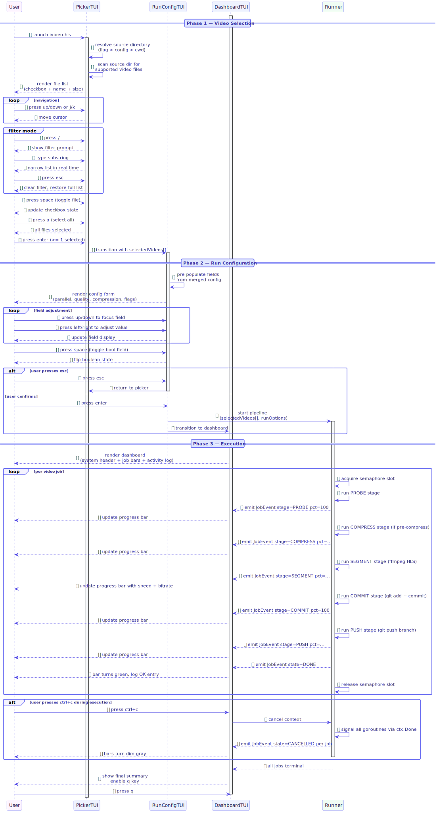

# FS-TUI-01 — Interactive Picker Flow

## Table of Contents

1. [Meta Information](#1-meta-information)
2. [Description & Use Case](#2-description--use-case)
3. [Pre-conditions & Post-conditions](#3-pre-conditions--post-conditions)
4. [Screen Contracts](#4-screen-contracts)
   - [4.1 Screen 1 — Video Picker](#41-screen-1--video-picker)
   - [4.2 Screen 2 — Run Config](#42-screen-2--run-config)
   - [4.3 Screen 3 — Run Dashboard](#43-screen-3--run-dashboard)
5. [Key Bindings Reference](#5-key-bindings-reference)
6. [State Machine](#6-state-machine)
7. [Technical Sequence Flow](#7-technical-sequence-flow)
8. [Change History](#8-change-history)

---

## 1. Meta Information

| Field      | Value                    |
|------------|--------------------------|
| Flow ID    | FS-TUI-01                |
| Subdomain  | Interactive Picker       |
| Status     | Approved                 |
| Version    | 1.0.0                    |
| Created    | 2026-06-17               |
| Author     | ichamrong                |

---

## 2. Description & Use Case

This flow covers the end-to-end interactive TUI experience for selecting videos, configuring a run, and monitoring live pipeline execution. The user launches `ivideo-hls` without arguments (or with `--tui`), is presented with a file picker over the source directory, selects one or more video files, configures per-run options, and then watches a live dashboard as each video is processed and pushed to a git branch.

**Primary actors:** Developer / media engineer running batch HLS conversion locally.

**Entry point:** `ivideo-hls` CLI start (interactive mode).

**Exit points:**
- Successful completion of all selected jobs (Screen 3, all bars terminal-green).
- User quits at any screen before starting the pipeline.
- Fatal error causing the application to exit with a non-zero status.

---

## 3. Pre-conditions & Post-conditions

### Pre-conditions

- A valid source directory is accessible (from `--source`, `default_source_dir` in config, or cwd fallback).
- At least one supported video file (`.mp4`, `.mov`, `.mkv`, `.webm`, `.avi`) exists in the source directory (or subdirectories if recursive mode is active).
- `ffmpeg` and `ffprobe` are installed and on `$PATH`.
- A git remote is reachable (required for push; `default_no_push=true` bypasses this).

### Post-conditions

- **Success:** All selected videos have been segmented to HLS, committed, and pushed to their respective git branches. Optionally, source files are deleted if `keep_source=false`.
- **Partial:** Some jobs completed, some failed. Dashboard shows per-job terminal states. Resume is possible via the pipeline resume flow (FS-PIPELINE-02).
- **Quit before start:** No files are modified. Config changes made on Screen 2 apply only to the current session (not persisted to disk unless the user visits the settings screen).

---

## 4. Screen Contracts

### 4.1 Screen 1 — Video Picker

**Purpose:** Allow the user to browse and select one or more video files from the source directory before proceeding to run configuration.

**Layout:**

```
┌─────────────────────────────────────────────────────────┐
│ ivideo-hls  [source: ~/Videos]           [s]ettings     │
├──────────────────────────────────────────────────────────┤
│ [ ] intro.mp4                              142.3 MB      │
│ [x] demo_v2.mp4                             89.1 MB      │
│ [x] tutorial_part1.mov                     211.8 MB      │
│ [ ] raw_footage.mkv                        554.0 MB      │
│   ...                                                    │
├──────────────────────────────────────────────────────────┤
│ 2 selected  /  4 files                 [enter] → config  │
└─────────────────────────────────────────────────────────┘
```

**Data contract:**

| Column     | Source                              | Format              |
|------------|-------------------------------------|---------------------|
| Checkbox   | in-memory selection set             | `[ ]` / `[x]`      |
| Filename   | `os.ReadDir` on source dir          | basename only       |
| Size       | `FileInfo.Size()`                   | human-readable (MB) |

**Filter mode sub-state (`/` pressed):**
- A filter prompt replaces the status bar.
- Typing narrows the visible list in real time (case-insensitive substring).
- `enter` confirms filter (selections outside current view are preserved).
- `esc` clears the filter and returns all files.

**Invariants:**
- `enter` is disabled (no-op) when 0 files are selected.
- The list is sorted: selected files first (alphabetical), then unselected (alphabetical).

**Emits:** `[]VideoFile` (path, size, name) on `enter`.

---

### 4.2 Screen 2 — Run Config

**Purpose:** Let the user tune per-run pipeline parameters before starting execution.

**Layout:**

```
┌─────────────────────────────────────────────────────────┐
│ Run Configuration                   2 videos selected    │
├──────────────────────────────────────────────────────────┤
│  Parallel jobs       [  2  ]  (max: 2)                  │
│  Quality             [ medium ]                          │
│  Compression         [ balanced ]                        │
│  Pre-compress        [x] enabled                        │
│  Keep source         [ ] disabled                        │
├──────────────────────────────────────────────────────────┤
│  [enter] start    [esc] back    [q] quit                 │
└─────────────────────────────────────────────────────────┘
```

**Field definitions:**

| Field        | Type              | Range / Values                  | Default (from config)  |
|--------------|-------------------|---------------------------------|------------------------|
| Parallel jobs | int              | `[1, len(selectedVideos)]`      | `default_parallel`     |
| Quality      | enum              | `low`, `medium`, `high`         | `default_quality`      |
| Compression  | enum              | `fast`, `balanced`, `best`      | `default_compression`  |
| Pre-compress | bool              | enabled / disabled              | `default_precompress`  |
| Keep source  | bool              | enabled / disabled              | `default_keep_source`  |

**Constraint — Parallel jobs cap:**
The upper bound for parallel jobs is `min(N, len(selectedVideos))` where N is the machine's logical CPU count (or a hard cap from config). The TUI enforces this on `→` key: if the current value equals the cap, the `→` key is a no-op (no wrap-around).

**Defaults pre-population:** All fields are initialized from the active config (`config.toml` merged with env/flags). Changes here are session-scoped and do not modify the config file.

**Emits:** `RunOptions{Parallel, Quality, Compression, PreCompress, KeepSource}` on `enter`.

---

### 4.3 Screen 3 — Run Dashboard

**Purpose:** Show live progress for all in-flight and queued jobs, system-level stats, and a scrolling activity log.

**Layout:**

```
┌─────────────────────────────────────────────────────────┐
│ Elapsed: 01:23  ETA: 03:45  Slots: 2/2  Remote: gh/...  │
├──────────────────────────────────────────────────────────┤
│ demo_v2.mp4       [SEGMENT ████████░░░░░░] 53%  4.2MB/s │
│ tutorial_part1.mov [PUSH   ██████████████] 92%  1.1MB/s │
├──────────────────────────────────────────────────────────┤
│ [INFO]  demo_v2: starting HLS segmentation               │
│ [OK]    tutorial_part1: push complete → branch v-xyz     │
│ [WARN]  demo_v2: retrying segment 007 (attempt 2/3)      │
│ [ERROR] raw: ffprobe failed — skipping                   │
│                                     [ctrl+c] cancel all  │
└─────────────────────────────────────────────────────────┘
```

**System header fields:**

| Field   | Description                                                      |
|---------|------------------------------------------------------------------|
| Elapsed | Wall-clock time since pipeline start (`time.Since(startTime)`)  |
| ETA     | See formula below                                                |
| Slots   | `activeConcurrent / parallelCapacity`                            |
| Remote  | Shortened remote URL (host + repo path, token redacted)         |

**ETA formula:**

```
waves        = ceil(pendingVideos / parallelCapacity)
ETA          = avgDuration * waves + avgDuration / 2
```

Where `avgDuration` is the rolling mean of all completed job durations so far. Until at least one job completes, ETA displays `--:--`.

**Per-job progress bar fields:**

| Field      | Description                                          |
|------------|------------------------------------------------------|
| Stage badge | Current pipeline stage: `PROBE`, `COMPRESS`, `SEGMENT`, `COMMIT`, `PUSH` |
| Fill       | Percentage complete within the current stage         |
| Speed      | Throughput (MB/s for data stages, objects/s for git) |
| Bitrate    | Output bitrate reported by ffmpeg (blank for git stages) |

**Activity log:**
- Displays the last 10 events.
- Color coding: `[INFO]` white, `[OK]` green, `[WARN]` yellow, `[ERROR]` red.
- Scrolling: auto-scrolls to newest entry. Read-only (no user scroll).

**Terminal job states:**

| State      | Bar color | Description                          |
|------------|-----------|--------------------------------------|
| DONE       | Green     | All stages completed and pushed       |
| FAILED     | Red       | Non-retriable error; job aborted      |
| CANCELLED  | Dim gray  | User cancelled via `ctrl+c`           |
| SKIPPED    | Yellow    | Pre-flight check failed (e.g., probe) |

**Exit rules:**
- `q` is only active after all jobs have reached a terminal state.
- `ctrl+c` sends a cancellation signal to all in-flight goroutines and waits for graceful teardown before allowing `q`.

---

## 5. Key Bindings Reference

### Screen 1 — Video Picker

| Key(s)        | Action                                              |
|---------------|-----------------------------------------------------|
| `↑` / `k`     | Move cursor up                                      |
| `↓` / `j`     | Move cursor down                                    |
| `g`           | Jump to top of list                                 |
| `G`           | Jump to bottom of list                              |
| `space`       | Toggle selection on focused file                    |
| `a`           | Toggle all (select all if any unselected, else none)|
| `1`–`9`       | Select first N files (clears current selection)     |
| `/`           | Enter filter mode                                   |
| `s`           | Open Settings TUI (FS-CONFIG-01)                    |
| `enter`       | Proceed to Screen 2 (requires >= 1 selected)        |
| `q` / `esc`   | Quit application                                    |

### Screen 2 — Run Config

| Key(s)          | Action                                                |
|-----------------|-------------------------------------------------------|
| `↑` / `k`       | Move focus to previous field                          |
| `↓` / `j`       | Move focus to next field                              |
| `←` / `h`       | Decrease value / cycle enum backwards                 |
| `→` / `l`       | Increase value / cycle enum forwards                  |
| `space`         | Toggle boolean field                                  |
| `enter`         | Start pipeline (advance to Screen 3)                  |
| `esc`           | Return to Screen 1 (Video Picker)                     |
| `q` / `ctrl+c`  | Quit application                                      |

### Screen 3 — Run Dashboard

| Key(s)   | Action                                                          |
|----------|-----------------------------------------------------------------|
| `ctrl+c` | Cancel all in-flight jobs (graceful shutdown, then enables `q`) |
| `q`      | Quit (only active when all jobs are in a terminal state)        |

---

## 6. State Machine

```
              ┌──────────────────────────────────────┐
              │           Application Start           │
              └──────────────────┬───────────────────┘
                                 │
                                 ▼
                    ┌────────────────────────┐
                    │  STATE: VIDEO_PICKER   │ ◄──────────────────┐
                    │  (Screen 1)            │                    │
                    └────────────┬───────────┘                    │
                                 │                                │
                    ┌────────────┼────────────────────────┐       │
                    │           │                         │       │
                    ▼           ▼                         ▼       │
              ┌─────────┐ ┌──────────┐              ┌─────────┐  │
              │  QUIT   │ │ SETTINGS │              │ FILTER  │  │
              │  (exit) │ │ (overlay)│              │  MODE   │  │
              └─────────┘ └────┬─────┘              └────┬────┘  │
                               │ esc                     │ esc   │
                               └───────────────────────► │       │
                                                         │       │
                               enter (≥1 selected)       │ ──────┘
                    ┌──────────────────────────┐
                    │  STATE: RUN_CONFIG       │
                    │  (Screen 2)              │
                    └────────────┬─────────────┘
                                 │
                    ┌────────────┼────────────┐
                    │           │             │
                    ▼           ▼             ▼
              ┌─────────┐  ┌───────┐    ┌──────────────────┐
              │  QUIT   │  │ BACK  │    │  STATE: RUNNING  │
              │  (exit) │  │ (esc) │    │  (Screen 3)      │
              └─────────┘  └───┬───┘    └────────┬─────────┘
                               │                  │
                               └──► PICKER        │ all jobs terminal
                                                  ▼
                                        ┌─────────────────┐
                                        │  STATE: DONE    │
                                        │  (q to exit)    │
                                        └─────────────────┘
```

**States:**

| State       | Description                                      | Valid Transitions              |
|-------------|--------------------------------------------------|--------------------------------|
| VIDEO_PICKER | Browsing / selecting files                      | → RUN_CONFIG, SETTINGS, QUIT  |
| SETTINGS    | Settings overlay (FS-CONFIG-01)                  | → VIDEO_PICKER                 |
| FILTER_MODE | Inline text filter active on picker list         | → VIDEO_PICKER (esc/enter)     |
| RUN_CONFIG  | Configuring parallel/quality/etc.                | → RUNNING, VIDEO_PICKER, QUIT  |
| RUNNING     | Pipeline executing; dashboard displayed          | → DONE (all terminal), QUIT    |
| DONE        | All jobs terminal; awaiting `q`                  | → exit                         |

---

## 7. Technical Sequence Flow



> Source: [`assets/fs_tui_01_seq_picker.puml`](assets/fs_tui_01_seq_picker.puml)

**Summary of interactions:**

1. **Scan:** On startup, the TUI calls the file scanner with the resolved source directory path. The scanner returns a sorted `[]FileInfo` list filtered to supported extensions.
2. **Display:** The Bubble Tea `Update` loop renders Screen 1 with the file list model.
3. **Selection:** Key events mutate the in-memory selection set. No I/O occurs.
4. **enter → Screen 2:** The model transitions to `RUN_CONFIG` state, pre-populating fields from the merged config.
5. **enter → start:** A `StartPipeline` command is dispatched. The `Runner` receives `[]VideoFile` + `RunOptions` and spawns worker goroutines up to `Parallel` concurrency.
6. **Event streaming:** Workers emit `JobEvent{JobID, Stage, Percent, Speed, Bitrate, Level, Message}` messages on a channel. The Bubble Tea program polls this channel via `tea.Cmd` and converts events into model updates.
7. **Completion:** When all jobs reach a terminal state, the model sets `allDone=true`, enabling the `q` key.

**Concurrency model:**
- A semaphore (`chan struct{}` of size `Parallel`) gates goroutine acquisition.
- Each goroutine manages one `VideoFile` through all pipeline stages sequentially.
- `ctrl+c` closes a `context.Context`; all blocking operations select on `ctx.Done()`.

---

## 8. Change History

| Version | Date       | Author     | Description           |
|---------|------------|------------|-----------------------|
| 1.0.0   | 2026-06-17 | ichamrong  | Initial approved spec |
